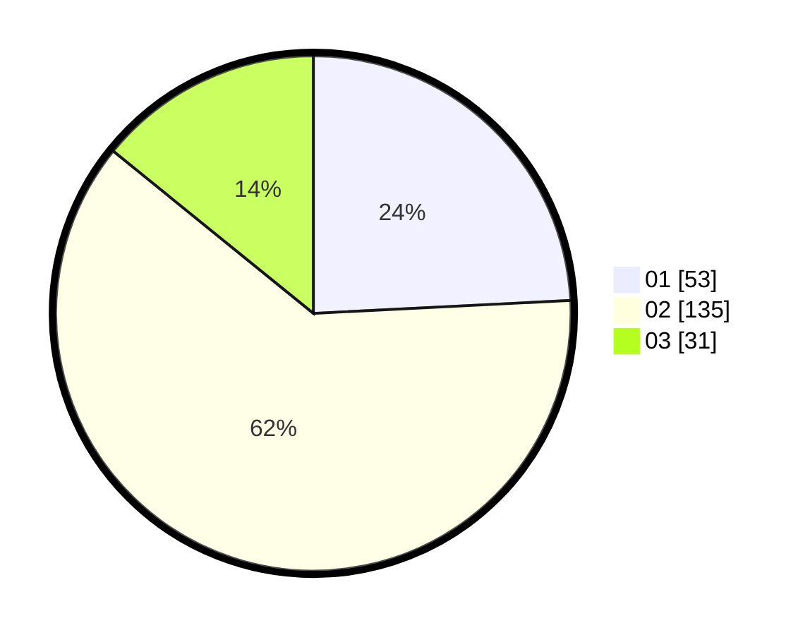

# Hasil

Hasil perolehan suara paslon dapat dilihat pada file paslon-01.txt, paslon-02.txt, dan paslon-03.txt.

Jika tidak ada, artinya data tersebut belum ada pada SIREKAP.

## Perolehan Suara

 * Paslon 01: **53**.
 * Paslon 02: **135**.
 * Paslon 03: **31**.

## Foto C Plano

https://sirekap-obj-formc.kpu.go.id/ef06/pemilu/ppwp/31/73/02/10/07/3173021007099-20240215-012902--5d269d49-4d98-4d44-9207-375645d0d7fa.jpg

https://sirekap-obj-formc.kpu.go.id/ef06/pemilu/ppwp/31/73/02/10/07/3173021007099-20240215-013107--1bfb36a4-48dd-4239-b708-bee82d022d59.jpg

https://sirekap-obj-formc.kpu.go.id/ef06/pemilu/ppwp/31/73/02/10/07/3173021007099-20240215-013206--bbf960f1-033f-4672-a97d-d0851e189d5b.jpg
