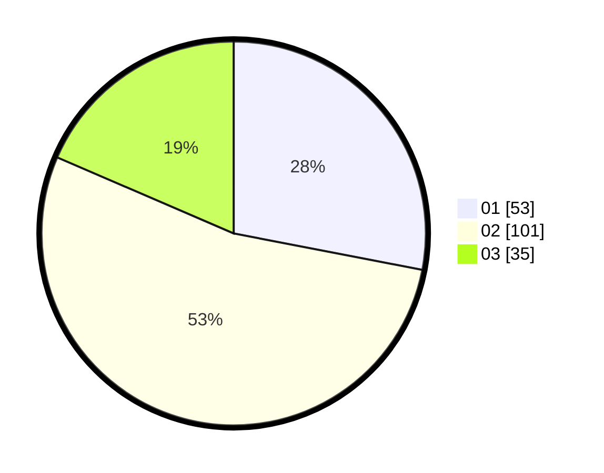

# Hasil

Hasil perolehan suara paslon dapat dilihat pada file paslon-01.txt, paslon-02.txt, dan paslon-03.txt.

Jika tidak ada, artinya data tersebut belum ada pada SIREKAP.

## Perolehan Suara

 * Paslon 01: **53**.
 * Paslon 02: **101**.
 * Paslon 03: **35**.

## Foto C Plano

https://sirekap-obj-formc.kpu.go.id/24e5/pemilu/ppwp/31/73/02/10/07/3173021007105-20240216-003038--0939b885-c9de-421d-b4e2-dc02ef0ddc68.jpg

https://sirekap-obj-formc.kpu.go.id/24e5/pemilu/ppwp/31/73/02/10/07/3173021007105-20240216-003040--33c40d6c-e051-4467-b459-1d4f2b219e10.jpg

https://sirekap-obj-formc.kpu.go.id/24e5/pemilu/ppwp/31/73/02/10/07/3173021007105-20240216-003039--8a7cc2a3-9a6a-411a-85f5-9d2f20cc3bfa.jpg

## DATA PEMILIH TETAP

Jumlah pemilih dalam DPT: **259**.
 * L: **132**.
 * P: **127**.

## DATA PENGGUNA HAK PILIH

Jumlah pengguna hak pilih dalam DPT: **187**.
 * L: **93**.
 * P: **94**.

Jumlah pengguna hak pilih dalam DPTb: **1**.
 * L: **0**.
 * P: **1**.

Jumlah pengguna hak pilih dalam DPK: **1**.
 * L: **1**.
 * P: **0**.

Jumlah pengguna hak pilih: **189**.
 * L: **94**.
 * P: **95**.

## JUMLAH SUARA SAH DAN TIDAK SAH

JUMLAH SELURUH SUARA SAH: **189**.

JUMLAH SUARA TIDAK SAH: **0**.

JUMLAH SELURUH SUARA SAH DAN SUARA TIDAK SAH: **189**.
