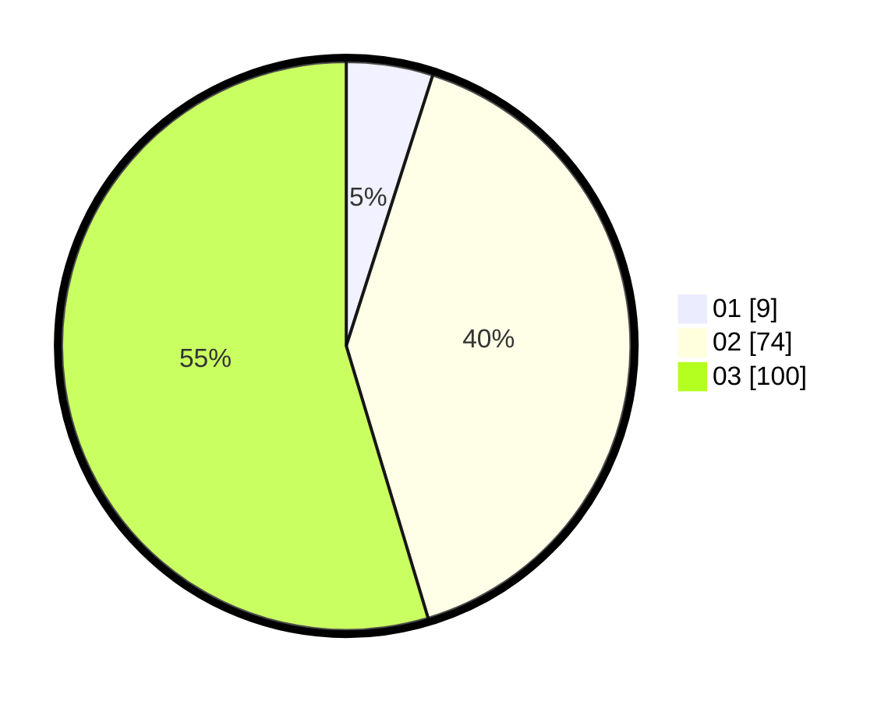

# Hasil

Hasil perolehan suara paslon dapat dilihat pada file paslon-01.txt, paslon-02.txt, dan paslon-03.txt.

Jika tidak ada, artinya data tersebut belum ada pada SIREKAP.

## Perolehan Suara

 * Paslon 01: **9**.
 * Paslon 02: **74**.
 * Paslon 03: **100**.

## Foto C Plano

https://sirekap-obj-formc.kpu.go.id/255b/pemilu/ppwp/31/73/02/10/07/3173021007106-20240214-194609--aa15c580-a00d-45dc-94b2-e7d2e6d367bb.jpg

https://sirekap-obj-formc.kpu.go.id/255b/pemilu/ppwp/31/73/02/10/07/3173021007106-20240214-194659--5e587e28-e483-4818-8945-e76f1b42bbab.jpg

https://sirekap-obj-formc.kpu.go.id/255b/pemilu/ppwp/31/73/02/10/07/3173021007106-20240214-194736--91186e01-1da6-435f-bcb8-4fa7906a77e6.jpg

## DATA PEMILIH TETAP

Jumlah pemilih dalam DPT: **239**.
 * L: **117**.
 * P: **122**.

## DATA PENGGUNA HAK PILIH

Jumlah pengguna hak pilih dalam DPT: **166**.
 * L: **81**.
 * P: **85**.

Jumlah pengguna hak pilih dalam DPTb: **16**.
 * L: **11**.
 * P: **5**.

Jumlah pengguna hak pilih dalam DPK: **3**.
 * L: **2**.
 * P: **1**.

Jumlah pengguna hak pilih: **185**.
 * L: **94**.
 * P: **91**.

## JUMLAH SUARA SAH DAN TIDAK SAH

JUMLAH SELURUH SUARA SAH: **183**.

JUMLAH SUARA TIDAK SAH: **2**.

JUMLAH SELURUH SUARA SAH DAN SUARA TIDAK SAH: **185**.
