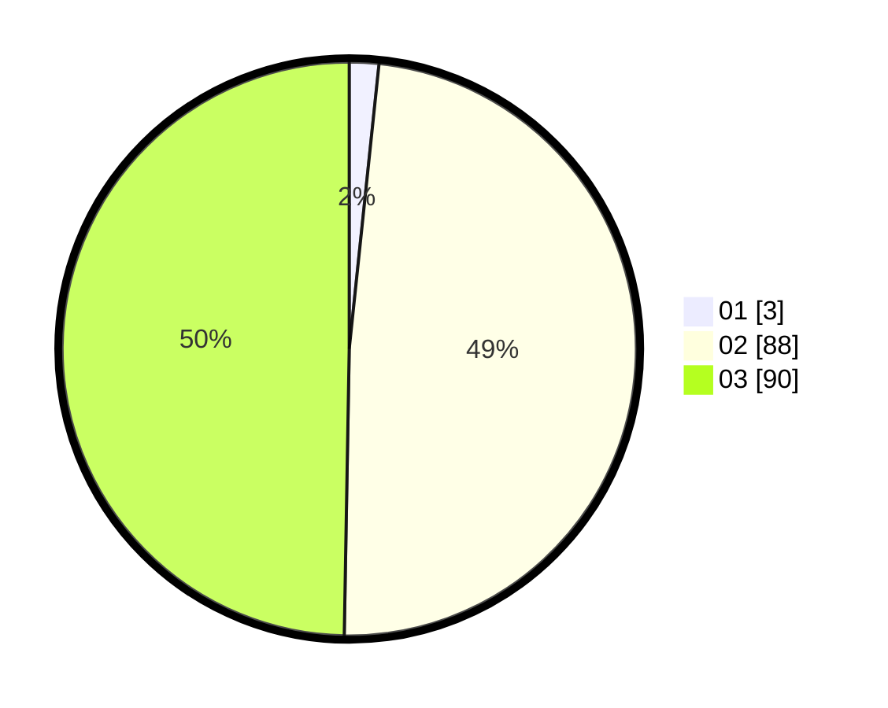

# Hasil

Hasil perolehan suara paslon dapat dilihat pada file paslon-01.txt, paslon-02.txt, dan paslon-03.txt.

Jika tidak ada, artinya data tersebut belum ada pada SIREKAP.

## Perolehan Suara

 * Paslon 01: **3**.
 * Paslon 02: **88**.
 * Paslon 03: **90**.

## Foto C Plano

https://sirekap-obj-formc.kpu.go.id/060a/pemilu/ppwp/31/73/02/10/07/3173021007109-20240214-191615--9793fa34-dcee-4f66-9288-497b83315b58.jpg

https://sirekap-obj-formc.kpu.go.id/060a/pemilu/ppwp/31/73/02/10/07/3173021007109-20240214-191621--2309a717-28ec-4494-a11d-2014c9c81d45.jpg

https://sirekap-obj-formc.kpu.go.id/060a/pemilu/ppwp/31/73/02/10/07/3173021007109-20240214-191626--b6a6431c-116a-4427-847e-956b5a64409e.jpg

## DATA PEMILIH TETAP

Jumlah pemilih dalam DPT: **255**.
 * L: **121**.
 * P: **134**.

## DATA PENGGUNA HAK PILIH

Jumlah pengguna hak pilih dalam DPT: **176**.
 * L: **91**.
 * P: **85**.

Jumlah pengguna hak pilih dalam DPTb: **1**.
 * L: **1**.
 * P: **0**.

Jumlah pengguna hak pilih dalam DPK: **4**.
 * L: **2**.
 * P: **2**.

Jumlah pengguna hak pilih: **181**.
 * L: **94**.
 * P: **87**.

## JUMLAH SUARA SAH DAN TIDAK SAH

JUMLAH SELURUH SUARA SAH: **181**.

JUMLAH SUARA TIDAK SAH: **0**.

JUMLAH SELURUH SUARA SAH DAN SUARA TIDAK SAH: **181**.
