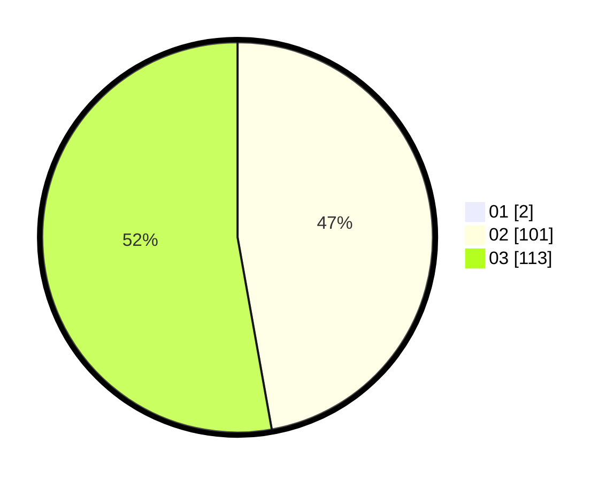

# Hasil

Hasil perolehan suara paslon dapat dilihat pada file paslon-01.txt, paslon-02.txt, dan paslon-03.txt.

Jika tidak ada, artinya data tersebut belum ada pada SIREKAP.

## Perolehan Suara

 * Paslon 01: **2**.
 * Paslon 02: **101**.
 * Paslon 03: **113**.

## Foto C Plano

https://sirekap-obj-formc.kpu.go.id/d4d5/pemilu/ppwp/31/73/02/10/07/3173021007110-20240214-185235--4c8106e6-23a5-450f-b39d-1e8d6a244756.jpg

https://sirekap-obj-formc.kpu.go.id/d4d5/pemilu/ppwp/31/73/02/10/07/3173021007110-20240214-185238--80689ccf-cd6b-4d40-b880-066529487db2.jpg

https://sirekap-obj-formc.kpu.go.id/d4d5/pemilu/ppwp/31/73/02/10/07/3173021007110-20240214-185242--b9bfdde8-1b31-4a57-b6f4-28a0f777ba03.jpg

## DATA PEMILIH TETAP

Jumlah pemilih dalam DPT: **286**.
 * L: **127**.
 * P: **159**.

## DATA PENGGUNA HAK PILIH

Jumlah pengguna hak pilih dalam DPT: **218**.
 * L: **100**.
 * P: **118**.

Jumlah pengguna hak pilih dalam DPTb: **1**.
 * L: **1**.
 * P: **0**.

Jumlah pengguna hak pilih dalam DPK: **0**.
 * L: **0**.
 * P: **0**.

Jumlah pengguna hak pilih: **219**.
 * L: **101**.
 * P: **118**.

## JUMLAH SUARA SAH DAN TIDAK SAH

JUMLAH SELURUH SUARA SAH: **216**.

JUMLAH SUARA TIDAK SAH: **3**.

JUMLAH SELURUH SUARA SAH DAN SUARA TIDAK SAH: **219**.
