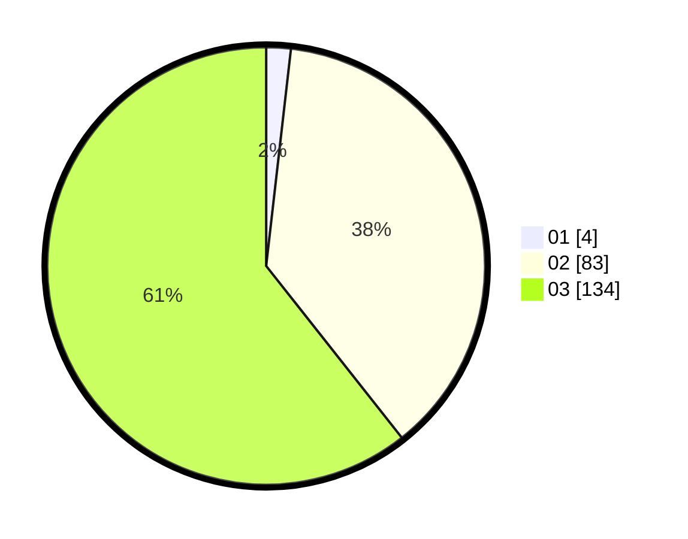

# Hasil

Hasil perolehan suara paslon dapat dilihat pada file paslon-01.txt, paslon-02.txt, dan paslon-03.txt.

Jika tidak ada, artinya data tersebut belum ada pada SIREKAP.

## Perolehan Suara

 * Paslon 01: **4**.
 * Paslon 02: **83**.
 * Paslon 03: **134**.

## Foto C Plano

https://sirekap-obj-formc.kpu.go.id/948c/pemilu/ppwp/31/73/02/10/07/3173021007111-20240214-155618--a723cbe1-b806-4def-b94e-cfb6ef7c1f95.jpg

https://sirekap-obj-formc.kpu.go.id/948c/pemilu/ppwp/31/73/02/10/07/3173021007111-20240214-155735--a2002445-6105-4406-bbf8-a03c2859dc4c.jpg

https://sirekap-obj-formc.kpu.go.id/948c/pemilu/ppwp/31/73/02/10/07/3173021007111-20240214-155808--3053c542-011d-45bc-8eb0-3e19b45bdb6a.jpg

## DATA PEMILIH TETAP

Jumlah pemilih dalam DPT: **276**.
 * L: **131**.
 * P: **145**.

## DATA PENGGUNA HAK PILIH

Jumlah pengguna hak pilih dalam DPT: **220**.
 * L: **109**.
 * P: **111**.

Jumlah pengguna hak pilih dalam DPTb: **4**.
 * L: **1**.
 * P: **3**.

Jumlah pengguna hak pilih dalam DPK: **0**.
 * L: **0**.
 * P: **0**.

Jumlah pengguna hak pilih: **224**.
 * L: **110**.
 * P: **114**.

## JUMLAH SUARA SAH DAN TIDAK SAH

JUMLAH SELURUH SUARA SAH: **227**.

JUMLAH SUARA TIDAK SAH: **47**.

JUMLAH SELURUH SUARA SAH DAN SUARA TIDAK SAH: **254**.
