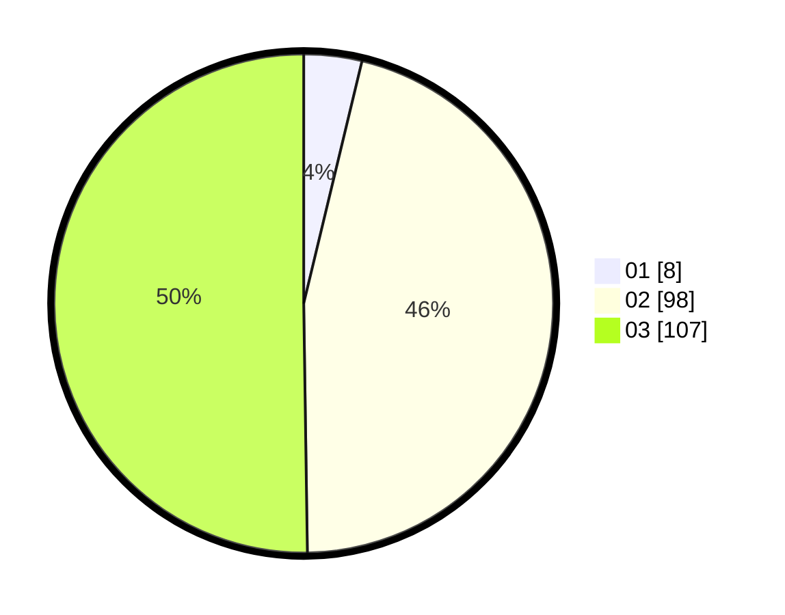

# Hasil

Hasil perolehan suara paslon dapat dilihat pada file paslon-01.txt, paslon-02.txt, dan paslon-03.txt.

Jika tidak ada, artinya data tersebut belum ada pada SIREKAP.

## Perolehan Suara

 * Paslon 01: **8**.
 * Paslon 02: **98**.
 * Paslon 03: **107**.

## Foto C Plano

https://sirekap-obj-formc.kpu.go.id/eba4/pemilu/ppwp/31/73/02/10/07/3173021007114-20240214-200615--a943b744-8a03-4e7f-9064-bb960551ac92.jpg

https://sirekap-obj-formc.kpu.go.id/eba4/pemilu/ppwp/31/73/02/10/07/3173021007114-20240214-210432--62677b04-de42-48e6-b7e8-5ed3a2a62efc.jpg

https://sirekap-obj-formc.kpu.go.id/eba4/pemilu/ppwp/31/73/02/10/07/3173021007114-20240214-210349--a7c90430-77f5-4236-89f9-1b5bade84487.jpg

## DATA PEMILIH TETAP

Jumlah pemilih dalam DPT: **282**.
 * L: **134**.
 * P: **148**.

## DATA PENGGUNA HAK PILIH

Jumlah pengguna hak pilih dalam DPT: **182**.
 * L: **92**.
 * P: **90**.

Jumlah pengguna hak pilih dalam DPTb: **24**.
 * L: **13**.
 * P: **11**.

Jumlah pengguna hak pilih dalam DPK: **9**.
 * L: **3**.
 * P: **6**.

Jumlah pengguna hak pilih: **215**.
 * L: **108**.
 * P: **107**.

## JUMLAH SUARA SAH DAN TIDAK SAH

JUMLAH SELURUH SUARA SAH: **213**.

JUMLAH SUARA TIDAK SAH: **2**.

JUMLAH SELURUH SUARA SAH DAN SUARA TIDAK SAH: **215**.
