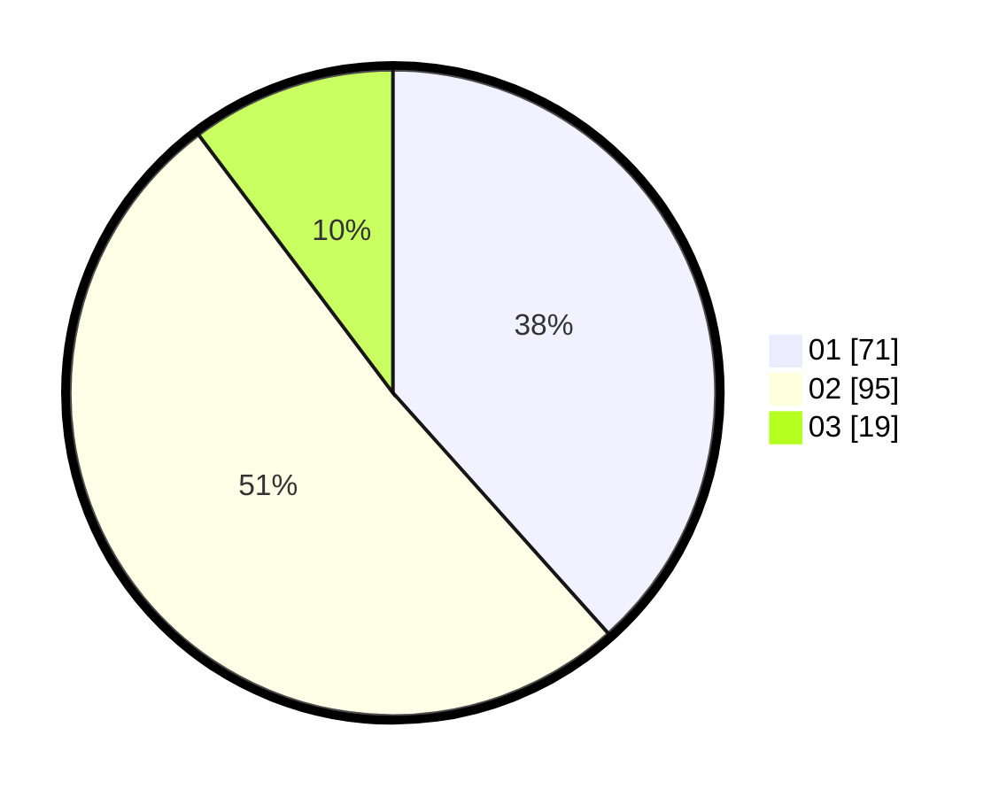

# Hasil

Hasil perolehan suara paslon dapat dilihat pada file paslon-01.txt, paslon-02.txt, dan paslon-03.txt.

Jika tidak ada, artinya data tersebut belum ada pada SIREKAP.

## Perolehan Suara

 * Paslon 01: **71**.
 * Paslon 02: **95**.
 * Paslon 03: **19**.

## Foto C Plano

https://sirekap-obj-formc.kpu.go.id/b4c8/pemilu/ppwp/31/73/02/10/07/3173021007118-20240215-214546--c137731b-0b00-4f30-aa1f-c68fb3ddac64.jpg

https://sirekap-obj-formc.kpu.go.id/b4c8/pemilu/ppwp/31/73/02/10/07/3173021007118-20240215-214548--023f6ca9-48ad-4c15-af42-1b093e4f19ac.jpg

https://sirekap-obj-formc.kpu.go.id/b4c8/pemilu/ppwp/31/73/02/10/07/3173021007118-20240215-214547--5201b69a-2a03-4926-b4dc-e1ace1f9d2ee.jpg

## DATA PEMILIH TETAP

Jumlah pemilih dalam DPT: **249**.
 * L: **126**.
 * P: **123**.

## DATA PENGGUNA HAK PILIH

Jumlah pengguna hak pilih dalam DPT: **185**.
 * L: **92**.
 * P: **93**.

Jumlah pengguna hak pilih dalam DPTb: **3**.
 * L: **2**.
 * P: **1**.

Jumlah pengguna hak pilih dalam DPK: **1**.
 * L: **1**.
 * P: **0**.

Jumlah pengguna hak pilih: **189**.
 * L: **95**.
 * P: **94**.

## JUMLAH SUARA SAH DAN TIDAK SAH

JUMLAH SELURUH SUARA SAH: **185**.

JUMLAH SUARA TIDAK SAH: **4**.

JUMLAH SELURUH SUARA SAH DAN SUARA TIDAK SAH: **189**.
