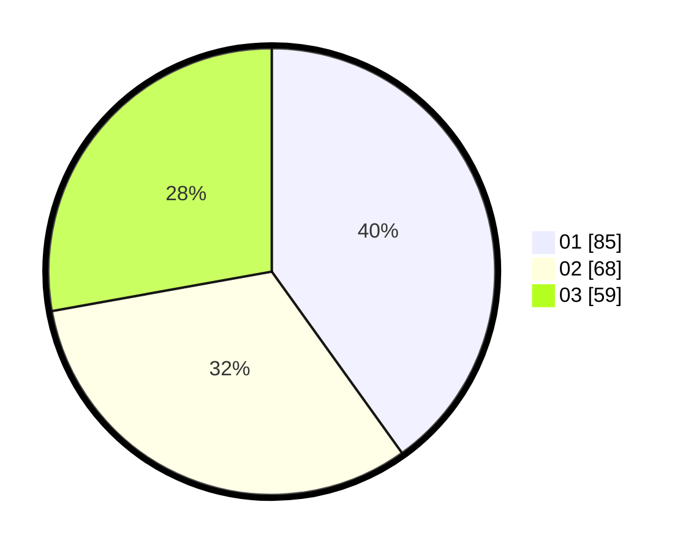

# Hasil

Hasil perolehan suara paslon dapat dilihat pada file paslon-01.txt, paslon-02.txt, dan paslon-03.txt.

Jika tidak ada, artinya data tersebut belum ada pada SIREKAP.

## Perolehan Suara

 * Paslon 01: **85**.
 * Paslon 02: **68**.
 * Paslon 03: **59**.

## Foto C Plano

https://sirekap-obj-formc.kpu.go.id/5454/pemilu/ppwp/31/73/02/10/07/3173021007121-20240214-231337--95d42701-8ac9-4acb-88b5-55ffeaa73867.jpg

https://sirekap-obj-formc.kpu.go.id/5454/pemilu/ppwp/31/73/02/10/07/3173021007121-20240214-231235--0f6801ea-3d60-483d-9070-db644e743cff.jpg

https://sirekap-obj-formc.kpu.go.id/5454/pemilu/ppwp/31/73/02/10/07/3173021007121-20240214-231120--604ed333-c506-46a3-bc6e-d298c86b548a.jpg
