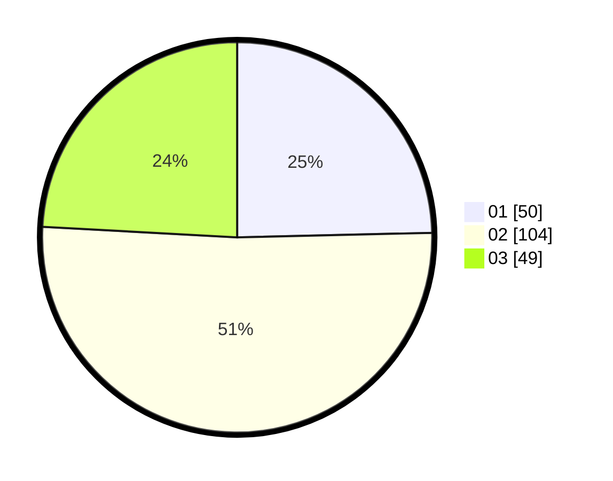

# Hasil

Hasil perolehan suara paslon dapat dilihat pada file paslon-01.txt, paslon-02.txt, dan paslon-03.txt.

Jika tidak ada, artinya data tersebut belum ada pada SIREKAP.

## Perolehan Suara

 * Paslon 01: **50**.
 * Paslon 02: **104**.
 * Paslon 03: **49**.

## Foto C Plano

https://sirekap-obj-formc.kpu.go.id/ab87/pemilu/ppwp/31/73/02/10/07/3173021007122-20240216-012923--df92e325-3ae4-4622-b108-bf1ed1121827.jpg

https://sirekap-obj-formc.kpu.go.id/ab87/pemilu/ppwp/31/73/02/10/07/3173021007122-20240216-012925--971aea8c-6626-475b-ae09-0f1d706118b8.jpg

https://sirekap-obj-formc.kpu.go.id/ab87/pemilu/ppwp/31/73/02/10/07/3173021007122-20240215-202940--a0a80bef-ce73-41b5-b755-e2a518ffd647.jpg

## DATA PEMILIH TETAP

Jumlah pemilih dalam DPT: **277**.
 * L: **147**.
 * P: **130**.

## DATA PENGGUNA HAK PILIH

Jumlah pengguna hak pilih dalam DPT: **203**.
 * L: **107**.
 * P: **96**.

Jumlah pengguna hak pilih dalam DPTb: **1**.
 * L: **0**.
 * P: **1**.

Jumlah pengguna hak pilih dalam DPK: **0**.
 * L: **0**.
 * P: **0**.

Jumlah pengguna hak pilih: **204**.
 * L: **107**.
 * P: **97**.

## JUMLAH SUARA SAH DAN TIDAK SAH

JUMLAH SELURUH SUARA SAH: **203**.

JUMLAH SUARA TIDAK SAH: **1**.

JUMLAH SELURUH SUARA SAH DAN SUARA TIDAK SAH: **204**.
