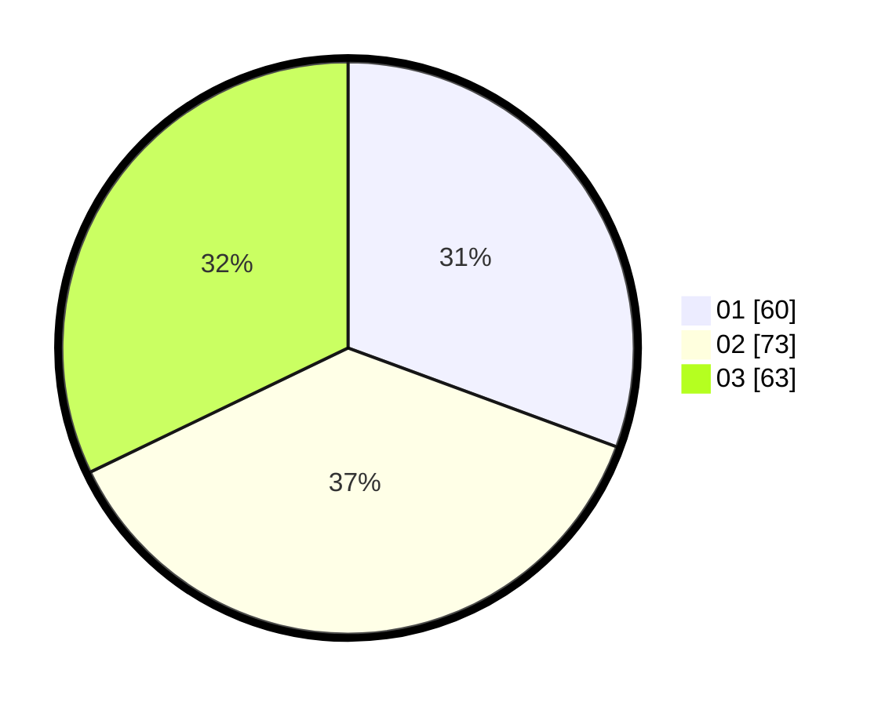

# Hasil

Hasil perolehan suara paslon dapat dilihat pada file paslon-01.txt, paslon-02.txt, dan paslon-03.txt.

Jika tidak ada, artinya data tersebut belum ada pada SIREKAP.

## Perolehan Suara

 * Paslon 01: **60**.
 * Paslon 02: **73**.
 * Paslon 03: **63**.

## Foto C Plano

https://sirekap-obj-formc.kpu.go.id/7685/pemilu/ppwp/31/73/02/10/07/3173021007123-20240216-151229--ecd69e7c-b654-45ad-9388-0e0174159245.jpg

https://sirekap-obj-formc.kpu.go.id/7685/pemilu/ppwp/31/73/02/10/07/3173021007123-20240216-151230--e8edf44c-4728-4465-91bf-957f75176489.jpg

https://sirekap-obj-formc.kpu.go.id/7685/pemilu/ppwp/31/73/02/10/07/3173021007123-20240216-151229--f1384bc3-540c-41a3-9f25-68fdb03ae049.jpg

## DATA PEMILIH TETAP

Jumlah pemilih dalam DPT: **267**.
 * L: **142**.
 * P: **125**.

## DATA PENGGUNA HAK PILIH

Jumlah pengguna hak pilih dalam DPT: **195**.
 * L: **99**.
 * P: **96**.

Jumlah pengguna hak pilih dalam DPTb: **0**.
 * L: **0**.
 * P: **0**.

Jumlah pengguna hak pilih dalam DPK: **2**.
 * L: **1**.
 * P: **1**.

Jumlah pengguna hak pilih: **197**.
 * L: **100**.
 * P: **97**.

## JUMLAH SUARA SAH DAN TIDAK SAH

JUMLAH SELURUH SUARA SAH: **196**.

JUMLAH SUARA TIDAK SAH: **1**.

JUMLAH SELURUH SUARA SAH DAN SUARA TIDAK SAH: **197**.
