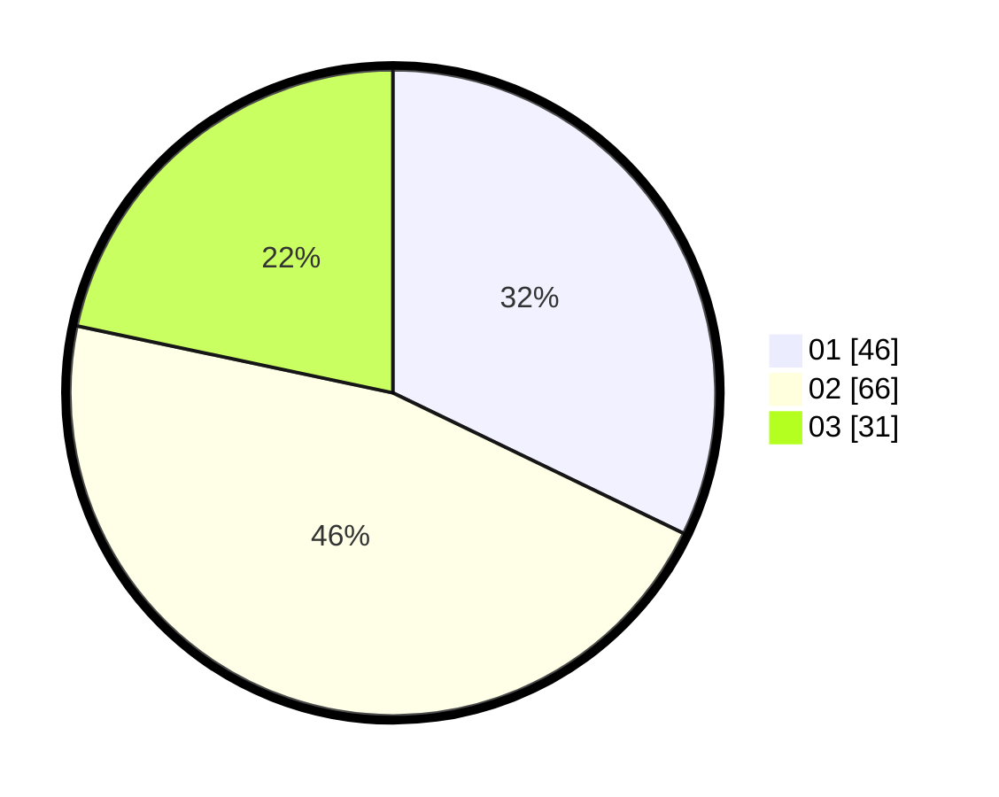

# Hasil

Hasil perolehan suara paslon dapat dilihat pada file paslon-01.txt, paslon-02.txt, dan paslon-03.txt.

Jika tidak ada, artinya data tersebut belum ada pada SIREKAP.

## Perolehan Suara

 * Paslon 01: **46**.
 * Paslon 02: **66**.
 * Paslon 03: **31**.

## Foto C Plano

https://sirekap-obj-formc.kpu.go.id/db9d/pemilu/ppwp/31/73/02/10/07/3173021007124-20240216-120016--f7c535d8-9353-4ce1-8762-bddfc793ed2e.jpg

https://sirekap-obj-formc.kpu.go.id/db9d/pemilu/ppwp/31/73/02/10/07/3173021007124-20240216-120024--60fe2621-c5d3-428a-989f-6124a6e81a8f.jpg

https://sirekap-obj-formc.kpu.go.id/db9d/pemilu/ppwp/31/73/02/10/07/3173021007124-20240216-120021--bd3c404d-b4bb-4a5e-ae1d-fef655fff933.jpg

## DATA PEMILIH TETAP

Jumlah pemilih dalam DPT: **224**.
 * L: **106**.
 * P: **118**.

## DATA PENGGUNA HAK PILIH

Jumlah pengguna hak pilih dalam DPT: **146**.
 * L: **67**.
 * P: **79**.

Jumlah pengguna hak pilih dalam DPTb: **0**.
 * L: **0**.
 * P: **0**.

Jumlah pengguna hak pilih dalam DPK: **0**.
 * L: **0**.
 * P: **0**.

Jumlah pengguna hak pilih: **146**.
 * L: **67**.
 * P: **79**.

## JUMLAH SUARA SAH DAN TIDAK SAH

JUMLAH SELURUH SUARA SAH: **143**.

JUMLAH SUARA TIDAK SAH: **3**.

JUMLAH SELURUH SUARA SAH DAN SUARA TIDAK SAH: **146**.
