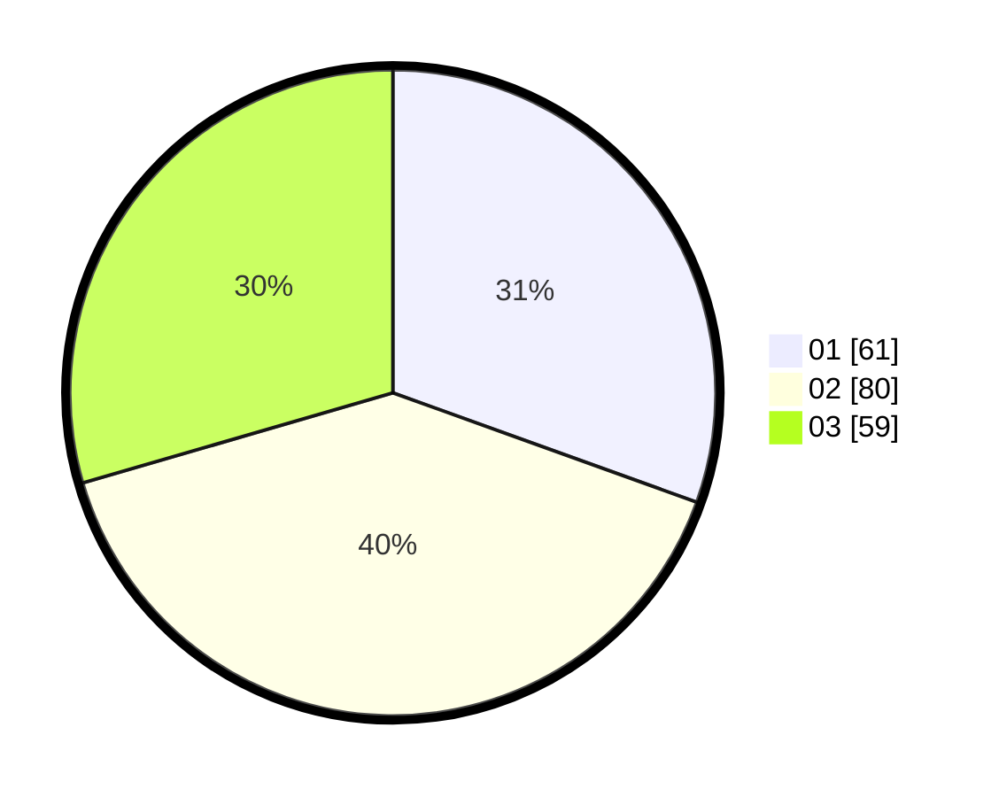

# Hasil

Hasil perolehan suara paslon dapat dilihat pada file paslon-01.txt, paslon-02.txt, dan paslon-03.txt.

Jika tidak ada, artinya data tersebut belum ada pada SIREKAP.

## Perolehan Suara

 * Paslon 01: **61**.
 * Paslon 02: **80**.
 * Paslon 03: **59**.

## Foto C Plano

https://sirekap-obj-formc.kpu.go.id/67ee/pemilu/ppwp/31/73/02/10/07/3173021007127-20240215-223317--65d53416-5311-4850-b60a-d6f1981492fa.jpg

https://sirekap-obj-formc.kpu.go.id/67ee/pemilu/ppwp/31/73/02/10/07/3173021007127-20240215-223319--83e9b78c-06eb-4b25-bac0-716b50ff3d9d.jpg

https://sirekap-obj-formc.kpu.go.id/67ee/pemilu/ppwp/31/73/02/10/07/3173021007127-20240215-223318--21557c2f-c431-455f-983c-1621a17de261.jpg

## DATA PEMILIH TETAP

Jumlah pemilih dalam DPT: **253**.
 * L: **125**.
 * P: **128**.

## DATA PENGGUNA HAK PILIH

Jumlah pengguna hak pilih dalam DPT: **200**.
 * L: **95**.
 * P: **105**.

Jumlah pengguna hak pilih dalam DPTb: **3**.
 * L: **1**.
 * P: **2**.

Jumlah pengguna hak pilih dalam DPK: **0**.
 * L: **0**.
 * P: **0**.

Jumlah pengguna hak pilih: **203**.
 * L: **96**.
 * P: **107**.

## JUMLAH SUARA SAH DAN TIDAK SAH

JUMLAH SELURUH SUARA SAH: **200**.

JUMLAH SUARA TIDAK SAH: **3**.

JUMLAH SELURUH SUARA SAH DAN SUARA TIDAK SAH: **203**.
