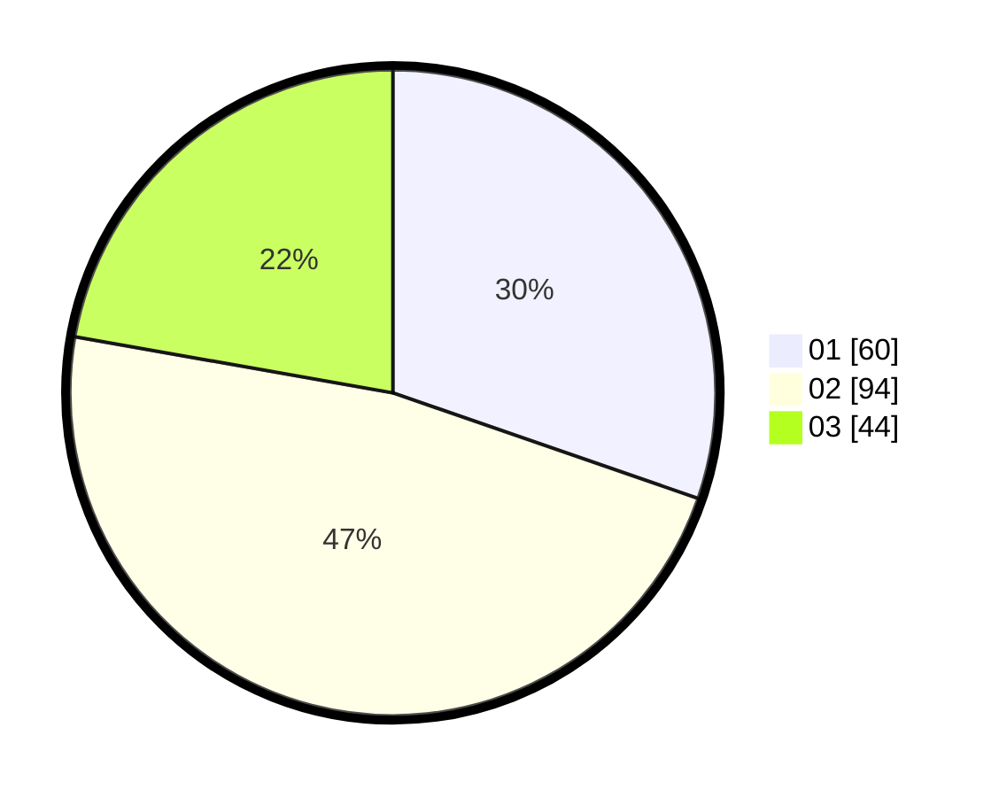

# Hasil

Hasil perolehan suara paslon dapat dilihat pada file paslon-01.txt, paslon-02.txt, dan paslon-03.txt.

Jika tidak ada, artinya data tersebut belum ada pada SIREKAP.

## Perolehan Suara

 * Paslon 01: **60**.
 * Paslon 02: **94**.
 * Paslon 03: **44**.

## Foto C Plano

https://sirekap-obj-formc.kpu.go.id/5ec9/pemilu/ppwp/31/73/02/10/07/3173021007128-20240216-072301--9fb3fc31-8435-4604-983a-8e6518fdcc29.jpg

https://sirekap-obj-formc.kpu.go.id/5ec9/pemilu/ppwp/31/73/02/10/07/3173021007128-20240216-072316--552958f2-39b1-4165-a620-98fc4f9714b9.jpg

https://sirekap-obj-formc.kpu.go.id/5ec9/pemilu/ppwp/31/73/02/10/07/3173021007128-20240216-072308--177f6299-fedb-4925-80db-4e23f12c6d23.jpg

## DATA PEMILIH TETAP

Jumlah pemilih dalam DPT: **264**.
 * L: **138**.
 * P: **126**.

## DATA PENGGUNA HAK PILIH

Jumlah pengguna hak pilih dalam DPT: **196**.
 * L: **100**.
 * P: **96**.

Jumlah pengguna hak pilih dalam DPTb: **3**.
 * L: **2**.
 * P: **1**.

Jumlah pengguna hak pilih dalam DPK: **0**.
 * L: **0**.
 * P: **0**.

Jumlah pengguna hak pilih: **199**.
 * L: **102**.
 * P: **97**.

## JUMLAH SUARA SAH DAN TIDAK SAH

JUMLAH SELURUH SUARA SAH: **198**.

JUMLAH SUARA TIDAK SAH: **1**.

JUMLAH SELURUH SUARA SAH DAN SUARA TIDAK SAH: **199**.
