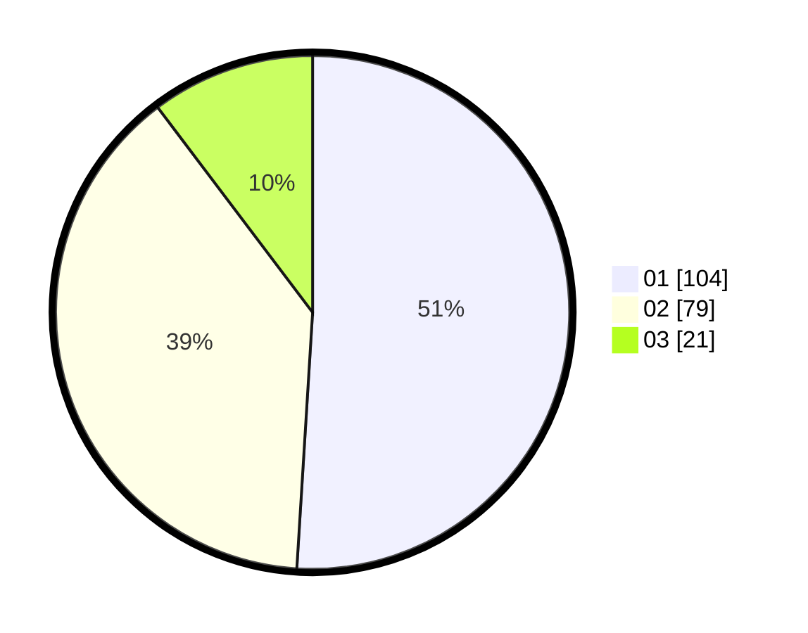

# Hasil

Hasil perolehan suara paslon dapat dilihat pada file paslon-01.txt, paslon-02.txt, dan paslon-03.txt.

Jika tidak ada, artinya data tersebut belum ada pada SIREKAP.

## Perolehan Suara

 * Paslon 01: **104**.
 * Paslon 02: **79**.
 * Paslon 03: **21**.

## Foto C Plano

https://sirekap-obj-formc.kpu.go.id/2bc1/pemilu/ppwp/31/73/02/10/07/3173021007132-20240214-215551--0e08493f-109d-4848-9dc2-c8e184ecb353.jpg

https://sirekap-obj-formc.kpu.go.id/2bc1/pemilu/ppwp/31/73/02/10/07/3173021007132-20240214-213733--ddff3c39-d21e-4737-8b90-63613c6aa082.jpg

https://sirekap-obj-formc.kpu.go.id/2bc1/pemilu/ppwp/31/73/02/10/07/3173021007132-20240214-214106--7967f252-b847-4e5c-9451-e4f75a0d8e26.jpg
