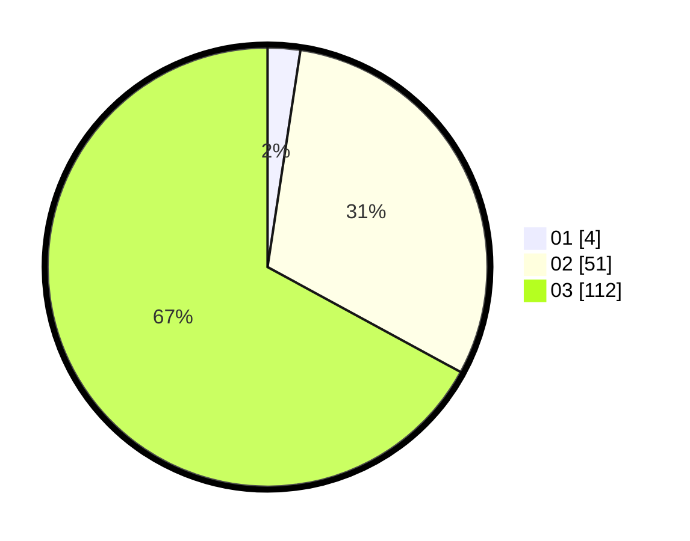

# Hasil

Hasil perolehan suara paslon dapat dilihat pada file paslon-01.txt, paslon-02.txt, dan paslon-03.txt.

Jika tidak ada, artinya data tersebut belum ada pada SIREKAP.

## Perolehan Suara

 * Paslon 01: **4**.
 * Paslon 02: **51**.
 * Paslon 03: **112**.

## Foto C Plano

https://sirekap-obj-formc.kpu.go.id/0d62/pemilu/ppwp/31/73/03/10/01/3173031001004-20240214-213724--370f0304-a49a-455f-bb68-a69c0d560a62.jpg

https://sirekap-obj-formc.kpu.go.id/0d62/pemilu/ppwp/31/73/03/10/01/3173031001004-20240214-213811--e53f8aa2-e41b-4d8c-a22d-7fdf9101ea73.jpg

https://sirekap-obj-formc.kpu.go.id/0d62/pemilu/ppwp/31/73/03/10/01/3173031001004-20240214-213836--f17692a1-6b9e-4bae-9789-8e3c1ec8843d.jpg
