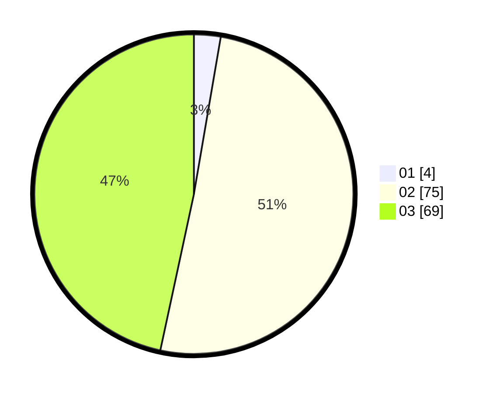

# Hasil

Hasil perolehan suara paslon dapat dilihat pada file paslon-01.txt, paslon-02.txt, dan paslon-03.txt.

Jika tidak ada, artinya data tersebut belum ada pada SIREKAP.

## Perolehan Suara

 * Paslon 01: **4**.
 * Paslon 02: **75**.
 * Paslon 03: **69**.

## Foto C Plano

https://sirekap-obj-formc.kpu.go.id/2d99/pemilu/ppwp/31/73/03/10/01/3173031001005-20240214-190328--34bf6abe-6b86-44f0-8ba7-d08ab0c882b8.jpg

https://sirekap-obj-formc.kpu.go.id/2d99/pemilu/ppwp/31/73/03/10/01/3173031001005-20240214-192715--4d1c46f1-795a-4606-ba62-7448661715f3.jpg

https://sirekap-obj-formc.kpu.go.id/2d99/pemilu/ppwp/31/73/03/10/01/3173031001005-20240214-192923--91d2fb14-b3ff-4119-8d19-9ac899044ab7.jpg
