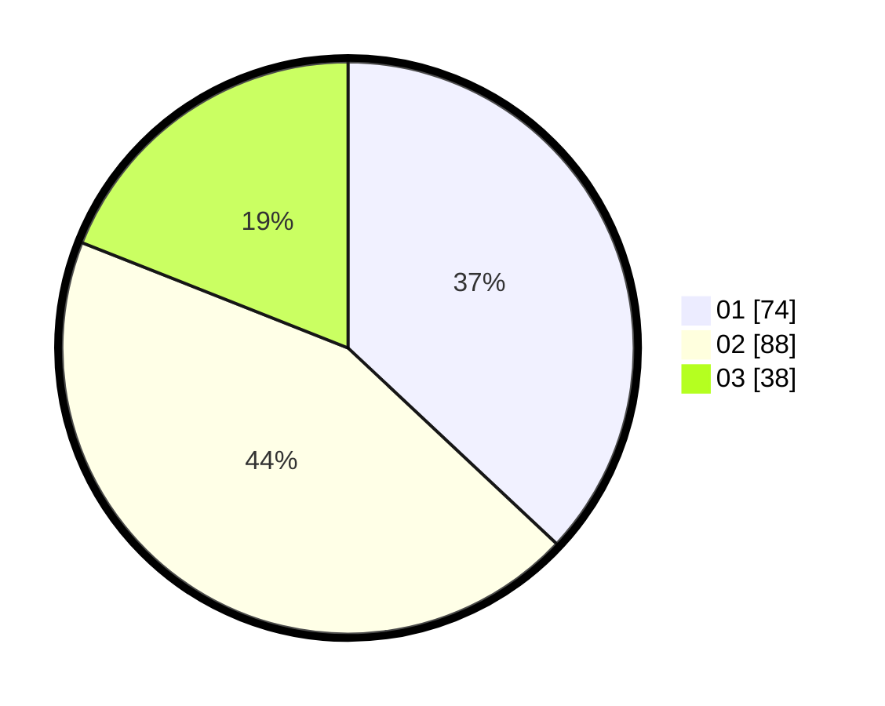

# Hasil

Hasil perolehan suara paslon dapat dilihat pada file paslon-01.txt, paslon-02.txt, dan paslon-03.txt.

Jika tidak ada, artinya data tersebut belum ada pada SIREKAP.

## Perolehan Suara

 * Paslon 01: **74**.
 * Paslon 02: **88**.
 * Paslon 03: **38**.

## Foto C Plano

https://sirekap-obj-formc.kpu.go.id/79fe/pemilu/ppwp/31/73/03/10/01/3173031001007-20240215-015418--ad06fa67-acb1-41f1-ac28-70c33eb02ac4.jpg

https://sirekap-obj-formc.kpu.go.id/79fe/pemilu/ppwp/31/73/03/10/01/3173031001007-20240215-001618--79568404-9a38-4dc4-9ad3-59d59cb393aa.jpg

https://sirekap-obj-formc.kpu.go.id/79fe/pemilu/ppwp/31/73/03/10/01/3173031001007-20240215-001756--3c2e2abb-753e-4d13-a1aa-3421a11b6434.jpg
