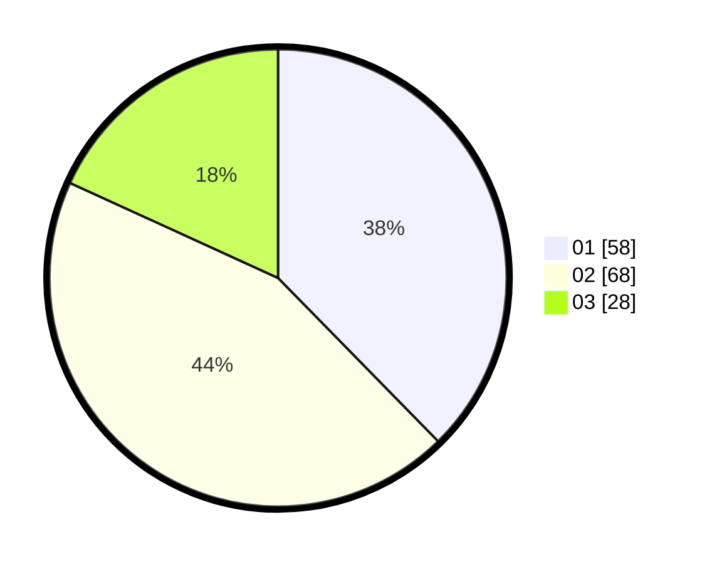

# Hasil

Hasil perolehan suara paslon dapat dilihat pada file paslon-01.txt, paslon-02.txt, dan paslon-03.txt.

Jika tidak ada, artinya data tersebut belum ada pada SIREKAP.

## Perolehan Suara

 * Paslon 01: **58**.
 * Paslon 02: **68**.
 * Paslon 03: **28**.

## Foto C Plano

https://sirekap-obj-formc.kpu.go.id/ce82/pemilu/ppwp/31/73/03/10/01/3173031001008-20240214-213404--d4db7961-c88b-42e2-8738-4a0beb287dd9.jpg

https://sirekap-obj-formc.kpu.go.id/ce82/pemilu/ppwp/31/73/03/10/01/3173031001008-20240214-213530--c8987487-838c-44a5-9a56-08a0f1184653.jpg

https://sirekap-obj-formc.kpu.go.id/ce82/pemilu/ppwp/31/73/03/10/01/3173031001008-20240214-213802--df5fcd1b-7c34-4b7b-b69e-d3553a0a88ca.jpg

## DATA PEMILIH TETAP

Jumlah pemilih dalam DPT: **236**.
 * L: **118**.
 * P: **118**.

## DATA PENGGUNA HAK PILIH

Jumlah pengguna hak pilih dalam DPT: **151**.
 * L: **73**.
 * P: **78**.

Jumlah pengguna hak pilih dalam DPTb: **4**.
 * L: **4**.
 * P: **0**.

Jumlah pengguna hak pilih dalam DPK: **2**.
 * L: **2**.
 * P: **0**.

Jumlah pengguna hak pilih: **157**.
 * L: **79**.
 * P: **78**.

## JUMLAH SUARA SAH DAN TIDAK SAH

JUMLAH SELURUH SUARA SAH: **154**.

JUMLAH SUARA TIDAK SAH: **3**.

JUMLAH SELURUH SUARA SAH DAN SUARA TIDAK SAH: **157**.
