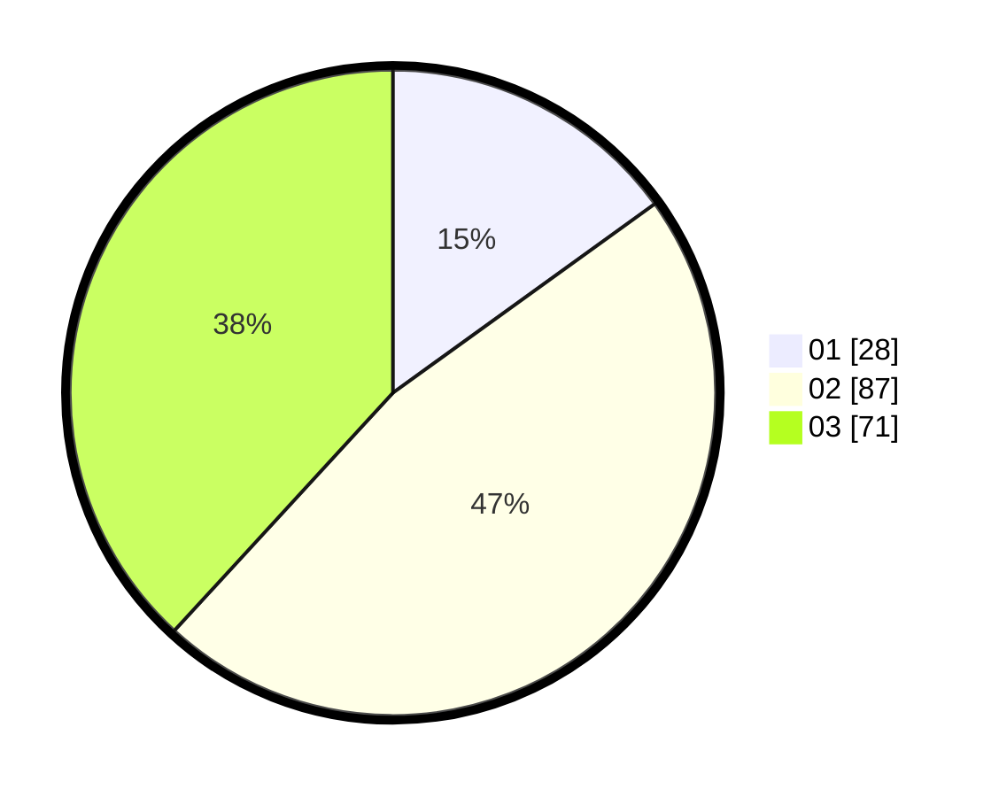

# Hasil

Hasil perolehan suara paslon dapat dilihat pada file paslon-01.txt, paslon-02.txt, dan paslon-03.txt.

Jika tidak ada, artinya data tersebut belum ada pada SIREKAP.

## Perolehan Suara

 * Paslon 01: **28**.
 * Paslon 02: **87**.
 * Paslon 03: **71**.

## Foto C Plano

https://sirekap-obj-formc.kpu.go.id/f4a9/pemilu/ppwp/31/73/03/10/01/3173031001013-20240214-194326--ae2a3415-54b3-481d-ac4c-9ab4602698c1.jpg

https://sirekap-obj-formc.kpu.go.id/f4a9/pemilu/ppwp/31/73/03/10/01/3173031001013-20240214-194406--e5fbe4e5-b4bf-42d9-b403-bb42e33dc9de.jpg

https://sirekap-obj-formc.kpu.go.id/f4a9/pemilu/ppwp/31/73/03/10/01/3173031001013-20240214-194302--b0698e81-e9a5-4cec-86f0-f08a43f04de2.jpg

## DATA PEMILIH TETAP

Jumlah pemilih dalam DPT: **268**.
 * L: **123**.
 * P: **145**.

## DATA PENGGUNA HAK PILIH

Jumlah pengguna hak pilih dalam DPT: **182**.
 * L: **90**.
 * P: **92**.

Jumlah pengguna hak pilih dalam DPTb: **3**.
 * L: **0**.
 * P: **3**.

Jumlah pengguna hak pilih dalam DPK: **3**.
 * L: **1**.
 * P: **2**.

Jumlah pengguna hak pilih: **188**.
 * L: **91**.
 * P: **97**.

## JUMLAH SUARA SAH DAN TIDAK SAH

JUMLAH SELURUH SUARA SAH: **186**.

JUMLAH SUARA TIDAK SAH: **2**.

JUMLAH SELURUH SUARA SAH DAN SUARA TIDAK SAH: **188**.
