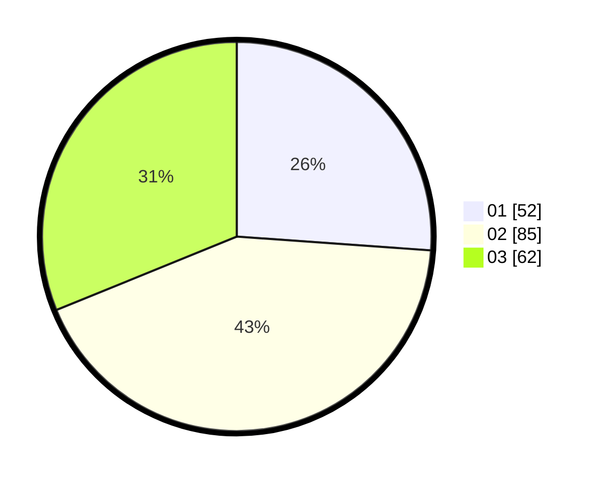

# Hasil

Hasil perolehan suara paslon dapat dilihat pada file paslon-01.txt, paslon-02.txt, dan paslon-03.txt.

Jika tidak ada, artinya data tersebut belum ada pada SIREKAP.

## Perolehan Suara

 * Paslon 01: **52**.
 * Paslon 02: **85**.
 * Paslon 03: **62**.

## Foto C Plano

https://sirekap-obj-formc.kpu.go.id/41f7/pemilu/ppwp/31/73/03/10/01/3173031001015-20240214-205822--85badb96-c7a2-4cc9-b629-cb0582fa5d23.jpg

https://sirekap-obj-formc.kpu.go.id/41f7/pemilu/ppwp/31/73/03/10/01/3173031001015-20240214-205835--72e1d10a-b1e0-4ce7-89da-b9856db17b0f.jpg

https://sirekap-obj-formc.kpu.go.id/41f7/pemilu/ppwp/31/73/03/10/01/3173031001015-20240214-205841--6747fd17-5bb9-4ae0-b8de-0265e65a69b1.jpg
