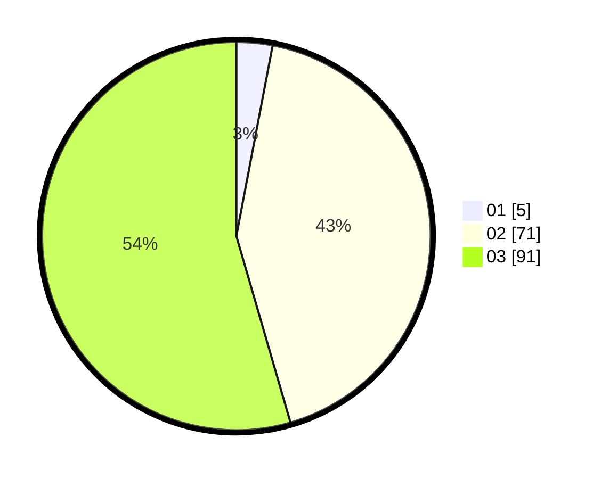

# Hasil

Hasil perolehan suara paslon dapat dilihat pada file paslon-01.txt, paslon-02.txt, dan paslon-03.txt.

Jika tidak ada, artinya data tersebut belum ada pada SIREKAP.

## Perolehan Suara

 * Paslon 01: **5**.
 * Paslon 02: **71**.
 * Paslon 03: **91**.

## Foto C Plano

https://sirekap-obj-formc.kpu.go.id/006b/pemilu/ppwp/31/73/03/10/01/3173031001021-20240215-211921--28660d1d-1de2-4e04-b6cb-4734d2c47e04.jpg

https://sirekap-obj-formc.kpu.go.id/006b/pemilu/ppwp/31/73/03/10/01/3173031001021-20240215-211923--ab0ea512-2892-4b78-b10a-85dad1d12c14.jpg

https://sirekap-obj-formc.kpu.go.id/006b/pemilu/ppwp/31/73/03/10/01/3173031001021-20240215-211922--102a5098-75aa-4f47-b187-4ad0cdafa55d.jpg

## DATA PEMILIH TETAP

Jumlah pemilih dalam DPT: **231**.
 * L: **104**.
 * P: **127**.

## DATA PENGGUNA HAK PILIH

Jumlah pengguna hak pilih dalam DPT: **166**.
 * L: **74**.
 * P: **92**.

Jumlah pengguna hak pilih dalam DPTb: **1**.
 * L: **1**.
 * P: **0**.

Jumlah pengguna hak pilih dalam DPK: **2**.
 * L: **0**.
 * P: **2**.

Jumlah pengguna hak pilih: **169**.
 * L: **75**.
 * P: **94**.

## JUMLAH SUARA SAH DAN TIDAK SAH

JUMLAH SELURUH SUARA SAH: **167**.

JUMLAH SUARA TIDAK SAH: **2**.

JUMLAH SELURUH SUARA SAH DAN SUARA TIDAK SAH: **169**.
