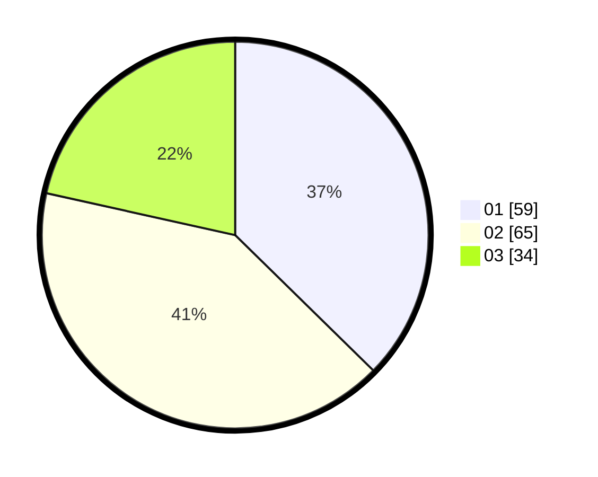

# Hasil

Hasil perolehan suara paslon dapat dilihat pada file paslon-01.txt, paslon-02.txt, dan paslon-03.txt.

Jika tidak ada, artinya data tersebut belum ada pada SIREKAP.

## Perolehan Suara

 * Paslon 01: **59**.
 * Paslon 02: **65**.
 * Paslon 03: **34**.

## Foto C Plano

https://sirekap-obj-formc.kpu.go.id/db19/pemilu/ppwp/31/73/03/10/01/3173031001023-20240215-211929--11dec6bf-27e8-4a27-9bf2-76ab451657d0.jpg

https://sirekap-obj-formc.kpu.go.id/db19/pemilu/ppwp/31/73/03/10/01/3173031001023-20240215-211930--ab446a24-eb4b-4089-bdb5-915112bc19a7.jpg

https://sirekap-obj-formc.kpu.go.id/db19/pemilu/ppwp/31/73/03/10/01/3173031001023-20240215-211929--495fa1b0-8e84-45f7-956d-660b73d730b7.jpg

## DATA PEMILIH TETAP

Jumlah pemilih dalam DPT: **224**.
 * L: **108**.
 * P: **116**.

## DATA PENGGUNA HAK PILIH

Jumlah pengguna hak pilih dalam DPT: **158**.
 * L: **76**.
 * P: **82**.

Jumlah pengguna hak pilih dalam DPTb: **0**.
 * L: **0**.
 * P: **0**.

Jumlah pengguna hak pilih dalam DPK: **1**.
 * L: **1**.
 * P: **0**.

Jumlah pengguna hak pilih: **159**.
 * L: **77**.
 * P: **82**.

## JUMLAH SUARA SAH DAN TIDAK SAH

JUMLAH SELURUH SUARA SAH: **158**.

JUMLAH SUARA TIDAK SAH: **1**.

JUMLAH SELURUH SUARA SAH DAN SUARA TIDAK SAH: **159**.
