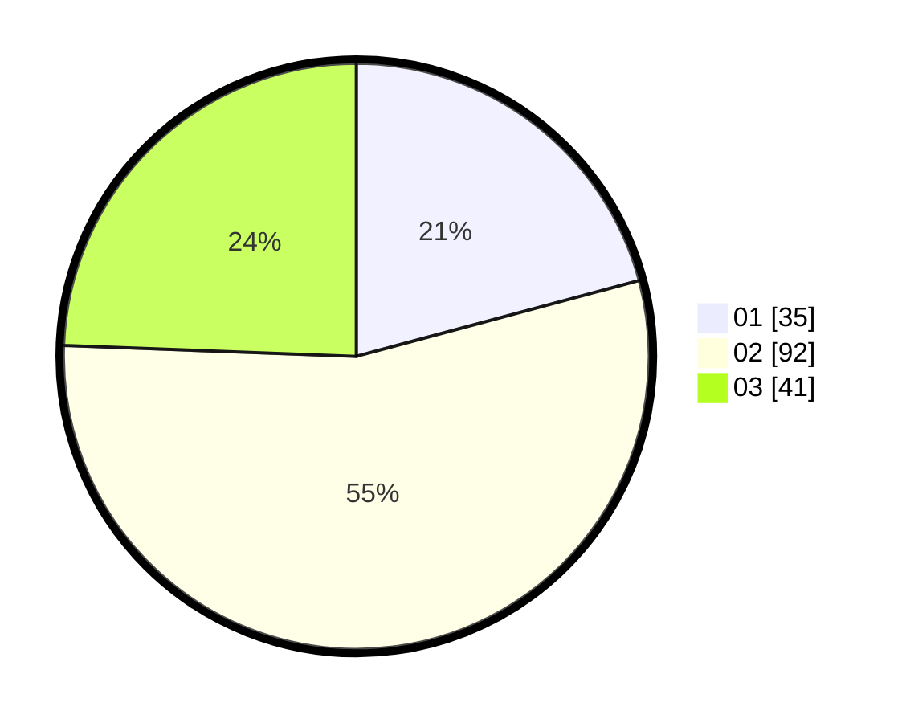

# Hasil

Hasil perolehan suara paslon dapat dilihat pada file paslon-01.txt, paslon-02.txt, dan paslon-03.txt.

Jika tidak ada, artinya data tersebut belum ada pada SIREKAP.

## Perolehan Suara

 * Paslon 01: **35**.
 * Paslon 02: **92**.
 * Paslon 03: **41**.

## Foto C Plano

https://sirekap-obj-formc.kpu.go.id/8f49/pemilu/ppwp/31/73/03/10/01/3173031001024-20240215-004513--19645e18-a39b-40fa-8de8-17c16df5892a.jpg

https://sirekap-obj-formc.kpu.go.id/8f49/pemilu/ppwp/31/73/03/10/01/3173031001024-20240215-004528--a29e7450-edaf-4f2f-949b-3fdc33b0cd2e.jpg

https://sirekap-obj-formc.kpu.go.id/8f49/pemilu/ppwp/31/73/03/10/01/3173031001024-20240215-004542--c2bd9796-838a-4d7f-bec1-5639a9d021e4.jpg
