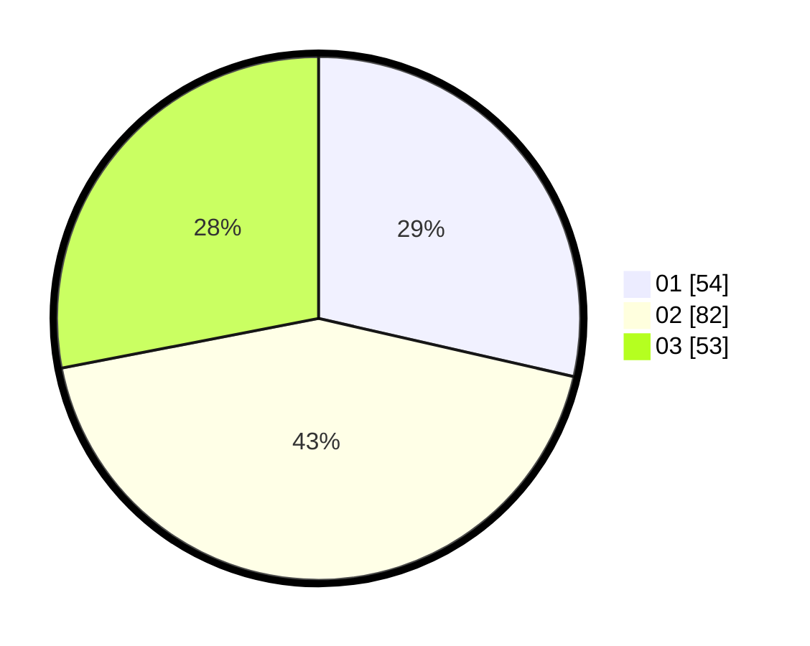

# Hasil

Hasil perolehan suara paslon dapat dilihat pada file paslon-01.txt, paslon-02.txt, dan paslon-03.txt.

Jika tidak ada, artinya data tersebut belum ada pada SIREKAP.

## Perolehan Suara

 * Paslon 01: **54**.
 * Paslon 02: **82**.
 * Paslon 03: **53**.

## Foto C Plano

https://sirekap-obj-formc.kpu.go.id/b9da/pemilu/ppwp/31/73/03/10/01/3173031001031-20240214-205516--5bb26252-cdeb-4a8d-934f-a2b6a291c30d.jpg

https://sirekap-obj-formc.kpu.go.id/b9da/pemilu/ppwp/31/73/03/10/01/3173031001031-20240214-205601--235fb89e-5e95-4ffd-aa0a-3f354d3a54fe.jpg

https://sirekap-obj-formc.kpu.go.id/b9da/pemilu/ppwp/31/73/03/10/01/3173031001031-20240214-205655--e7f06639-058d-4a97-83c9-3d04df09a37e.jpg
