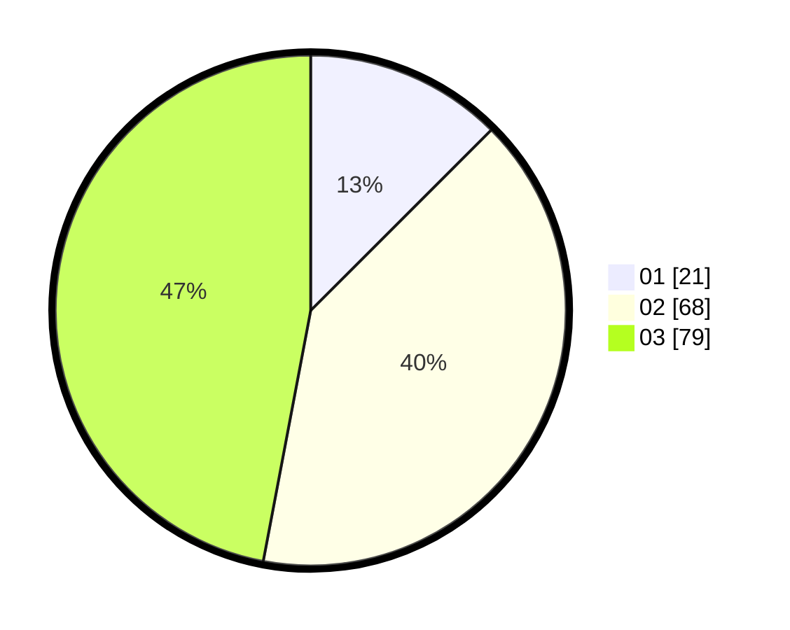

# Hasil

Hasil perolehan suara paslon dapat dilihat pada file paslon-01.txt, paslon-02.txt, dan paslon-03.txt.

Jika tidak ada, artinya data tersebut belum ada pada SIREKAP.

## Perolehan Suara

 * Paslon 01: **21**.
 * Paslon 02: **68**.
 * Paslon 03: **79**.

## Foto C Plano

https://sirekap-obj-formc.kpu.go.id/5922/pemilu/ppwp/31/73/03/10/01/3173031001035-20240214-205440--eb31dece-9ce0-443a-8b7c-9fe244145860.jpg

https://sirekap-obj-formc.kpu.go.id/5922/pemilu/ppwp/31/73/03/10/01/3173031001035-20240214-205452--648a5143-da81-4840-b607-aecff01b431e.jpg

https://sirekap-obj-formc.kpu.go.id/5922/pemilu/ppwp/31/73/03/10/01/3173031001035-20240214-205609--9d52f209-71ba-4032-868a-77ff27c552a9.jpg
