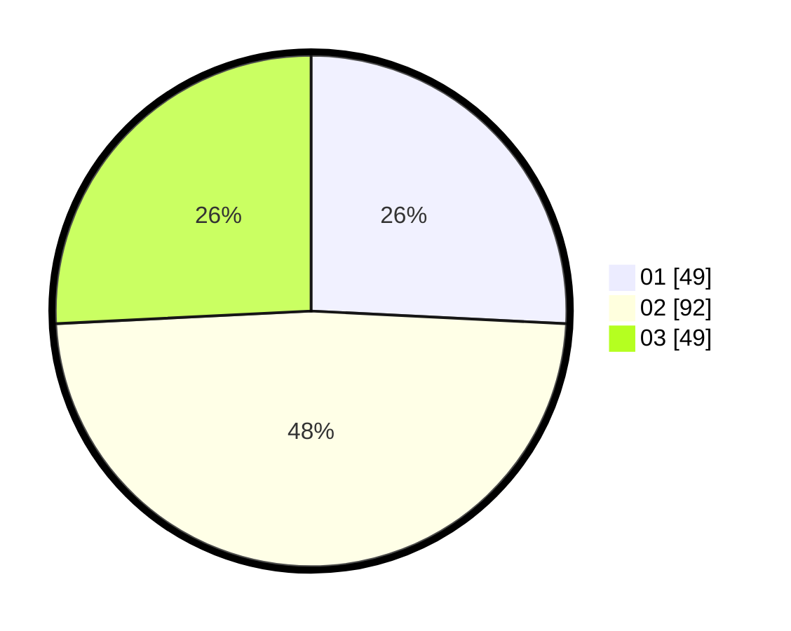

# Hasil

Hasil perolehan suara paslon dapat dilihat pada file paslon-01.txt, paslon-02.txt, dan paslon-03.txt.

Jika tidak ada, artinya data tersebut belum ada pada SIREKAP.

## Perolehan Suara

 * Paslon 01: **49**.
 * Paslon 02: **92**.
 * Paslon 03: **49**.

## Foto C Plano

https://sirekap-obj-formc.kpu.go.id/8b22/pemilu/ppwp/31/73/03/10/01/3173031001036-20240214-213634--c1216d01-92b5-418f-9159-bb2b211224b3.jpg

https://sirekap-obj-formc.kpu.go.id/8b22/pemilu/ppwp/31/73/03/10/01/3173031001036-20240214-213852--69b2e770-4718-4d4f-baa1-cceeab35cab9.jpg

https://sirekap-obj-formc.kpu.go.id/8b22/pemilu/ppwp/31/73/03/10/01/3173031001036-20240214-214033--4a2eba4f-78ba-4706-b512-2c51fe9d2d02.jpg

## DATA PEMILIH TETAP

Jumlah pemilih dalam DPT: **250**.
 * L: **121**.
 * P: **129**.

## DATA PENGGUNA HAK PILIH

Jumlah pengguna hak pilih dalam DPT: **192**.
 * L: **90**.
 * P: **102**.

Jumlah pengguna hak pilih dalam DPTb: **0**.
 * L: **0**.
 * P: **0**.

Jumlah pengguna hak pilih dalam DPK: **2**.
 * L: **2**.
 * P: **0**.

Jumlah pengguna hak pilih: **194**.
 * L: **92**.
 * P: **102**.

## JUMLAH SUARA SAH DAN TIDAK SAH

JUMLAH SELURUH SUARA SAH: **190**.

JUMLAH SUARA TIDAK SAH: **4**.

JUMLAH SELURUH SUARA SAH DAN SUARA TIDAK SAH: **194**.
