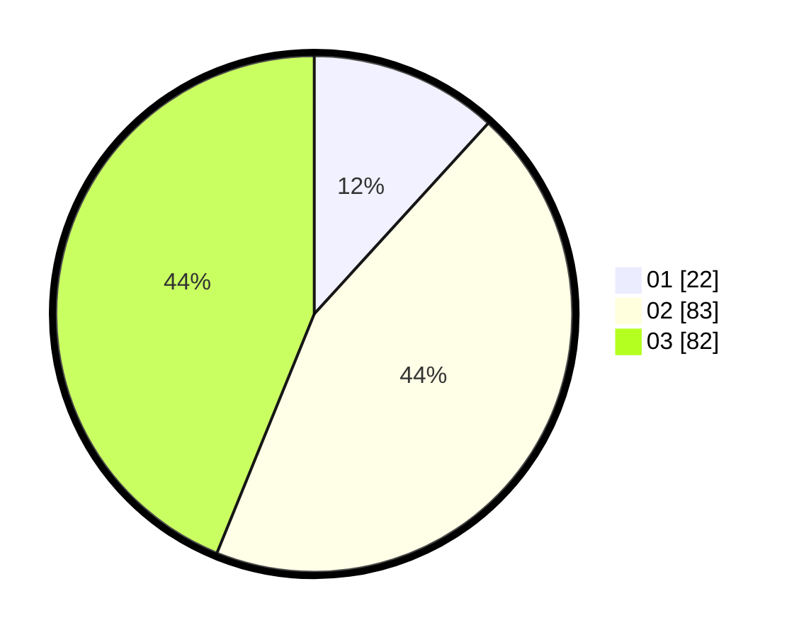

# Hasil

Hasil perolehan suara paslon dapat dilihat pada file paslon-01.txt, paslon-02.txt, dan paslon-03.txt.

Jika tidak ada, artinya data tersebut belum ada pada SIREKAP.

## Perolehan Suara

 * Paslon 01: **22**.
 * Paslon 02: **83**.
 * Paslon 03: **82**.

## Foto C Plano

https://sirekap-obj-formc.kpu.go.id/430b/pemilu/ppwp/31/73/03/10/01/3173031001039-20240214-155010--989be616-967f-4e24-965a-ec0dc7d418ad.jpg

https://sirekap-obj-formc.kpu.go.id/430b/pemilu/ppwp/31/73/03/10/01/3173031001039-20240214-155238--1de9b9ff-a798-4b7b-b3ae-e9457e439cc1.jpg

https://sirekap-obj-formc.kpu.go.id/430b/pemilu/ppwp/31/73/03/10/01/3173031001039-20240214-155355--3e9a7b2e-f03b-42b8-869d-09e0118c8728.jpg

## DATA PEMILIH TETAP

Jumlah pemilih dalam DPT: **255**.
 * L: **118**.
 * P: **137**.

## DATA PENGGUNA HAK PILIH

Jumlah pengguna hak pilih dalam DPT: **190**.
 * L: **87**.
 * P: **103**.

Jumlah pengguna hak pilih dalam DPTb: **0**.
 * L: **0**.
 * P: **0**.

Jumlah pengguna hak pilih dalam DPK: **0**.
 * L: **0**.
 * P: **0**.

Jumlah pengguna hak pilih: **190**.
 * L: **87**.
 * P: **103**.

## JUMLAH SUARA SAH DAN TIDAK SAH

JUMLAH SELURUH SUARA SAH: **187**.

JUMLAH SUARA TIDAK SAH: **3**.

JUMLAH SELURUH SUARA SAH DAN SUARA TIDAK SAH: **190**.
