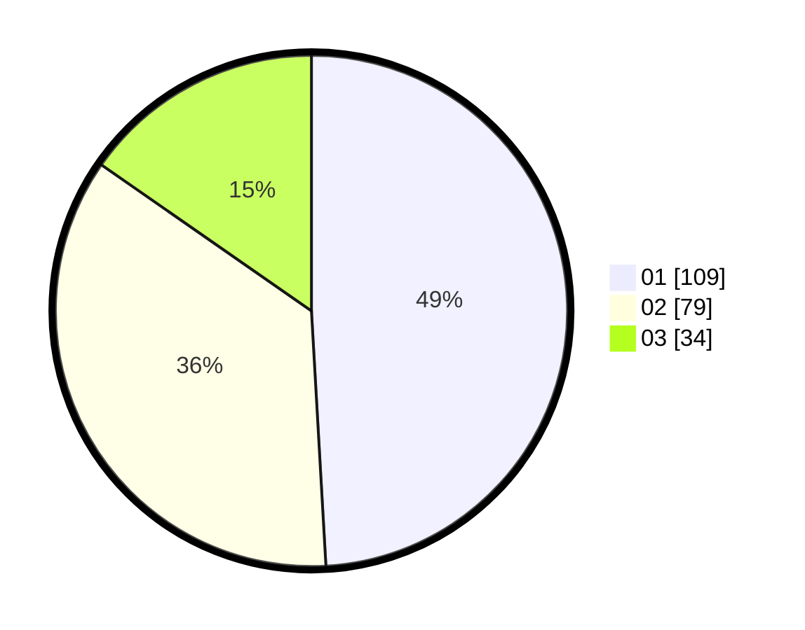

# Hasil

Hasil perolehan suara paslon dapat dilihat pada file paslon-01.txt, paslon-02.txt, dan paslon-03.txt.

Jika tidak ada, artinya data tersebut belum ada pada SIREKAP.

## Perolehan Suara

 * Paslon 01: **109**.
 * Paslon 02: **79**.
 * Paslon 03: **34**.

## Foto C Plano

https://sirekap-obj-formc.kpu.go.id/396b/pemilu/ppwp/31/73/03/10/01/3173031001040-20240215-011644--ad5a292e-04a0-4fec-94df-1888091e3cf4.jpg

https://sirekap-obj-formc.kpu.go.id/396b/pemilu/ppwp/31/73/03/10/01/3173031001040-20240214-155212--05d31cb6-b903-4031-af3a-800619db7d38.jpg

https://sirekap-obj-formc.kpu.go.id/396b/pemilu/ppwp/31/73/03/10/01/3173031001040-20240214-155457--530140e4-5cb0-4e76-9d6b-e5b07669b5f5.jpg
