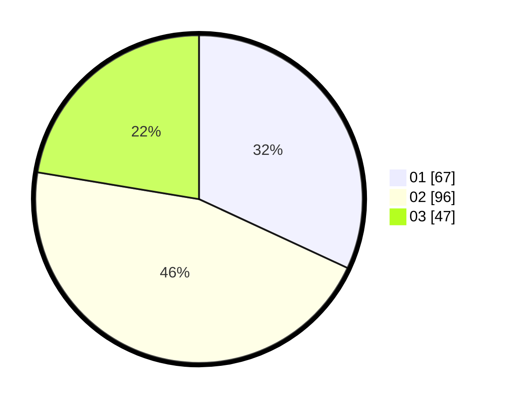

# Hasil

Hasil perolehan suara paslon dapat dilihat pada file paslon-01.txt, paslon-02.txt, dan paslon-03.txt.

Jika tidak ada, artinya data tersebut belum ada pada SIREKAP.

## Perolehan Suara

 * Paslon 01: **67**.
 * Paslon 02: **96**.
 * Paslon 03: **47**.

## Foto C Plano

https://sirekap-obj-formc.kpu.go.id/550c/pemilu/ppwp/31/73/03/10/01/3173031001044-20240214-233315--f3cb262a-4acc-45c2-994b-87e5270fe9b6.jpg

https://sirekap-obj-formc.kpu.go.id/550c/pemilu/ppwp/31/73/03/10/01/3173031001044-20240214-233417--cc9e85b0-cd18-46bf-8c7f-396823f48d71.jpg

https://sirekap-obj-formc.kpu.go.id/550c/pemilu/ppwp/31/73/03/10/01/3173031001044-20240214-233602--6faaf924-61a4-46df-9edc-2591195a88ba.jpg
