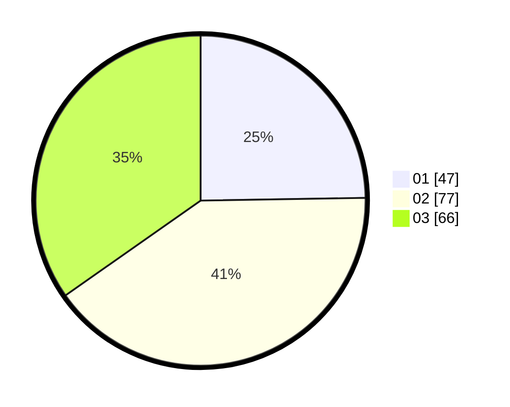

# Hasil

Hasil perolehan suara paslon dapat dilihat pada file paslon-01.txt, paslon-02.txt, dan paslon-03.txt.

Jika tidak ada, artinya data tersebut belum ada pada SIREKAP.

## Perolehan Suara

 * Paslon 01: **47**.
 * Paslon 02: **77**.
 * Paslon 03: **66**.

## Foto C Plano

https://sirekap-obj-formc.kpu.go.id/fb47/pemilu/ppwp/31/73/03/10/01/3173031001047-20240214-214505--a1fe155d-3bb8-4078-81ca-91e89f99a4dc.jpg

https://sirekap-obj-formc.kpu.go.id/fb47/pemilu/ppwp/31/73/03/10/01/3173031001047-20240214-214551--de2acfb9-8972-4a67-ac88-462cc8d39e20.jpg

https://sirekap-obj-formc.kpu.go.id/fb47/pemilu/ppwp/31/73/03/10/01/3173031001047-20240214-214628--78080bf8-6659-4bc4-b2bc-9470c5937c98.jpg
