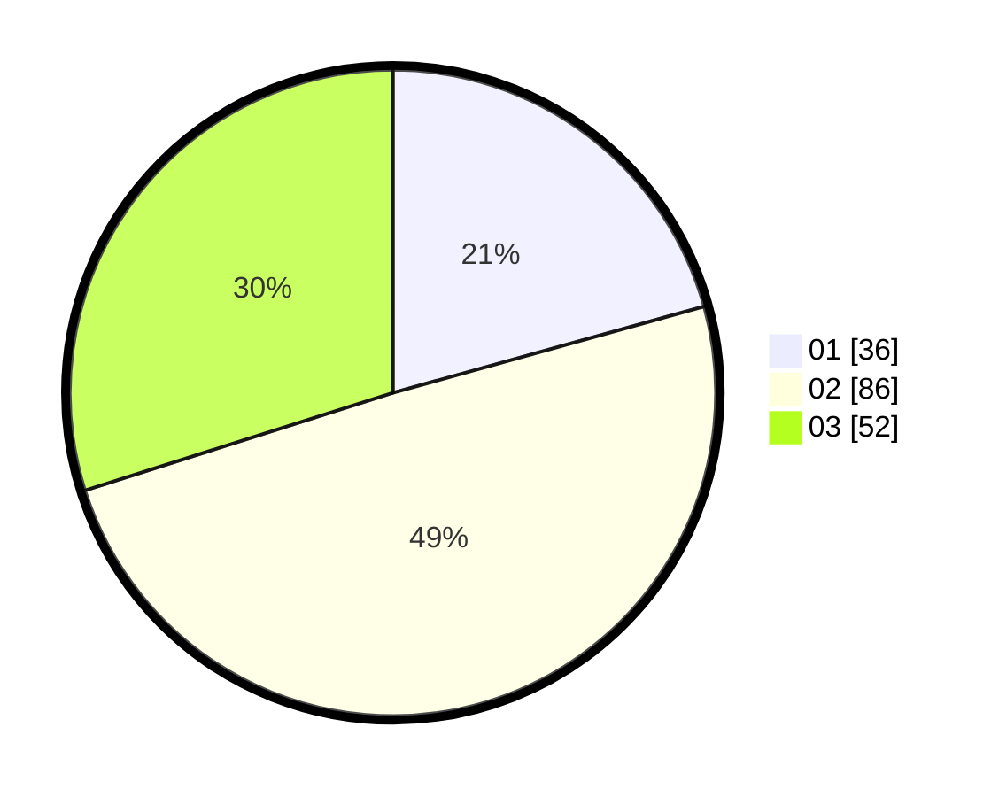

# Hasil

Hasil perolehan suara paslon dapat dilihat pada file paslon-01.txt, paslon-02.txt, dan paslon-03.txt.

Jika tidak ada, artinya data tersebut belum ada pada SIREKAP.

## Perolehan Suara

 * Paslon 01: **36**.
 * Paslon 02: **86**.
 * Paslon 03: **52**.

## Foto C Plano

https://sirekap-obj-formc.kpu.go.id/6845/pemilu/ppwp/31/73/03/10/01/3173031001048-20240214-201917--95d01e9d-22b4-442f-bf3f-9d617fbe17d0.jpg

https://sirekap-obj-formc.kpu.go.id/6845/pemilu/ppwp/31/73/03/10/01/3173031001048-20240214-202048--ba073709-9164-4757-abc9-4e946d10373e.jpg

https://sirekap-obj-formc.kpu.go.id/6845/pemilu/ppwp/31/73/03/10/01/3173031001048-20240214-202128--4e41bc3d-b5df-45fd-9239-fdba66a479e7.jpg
