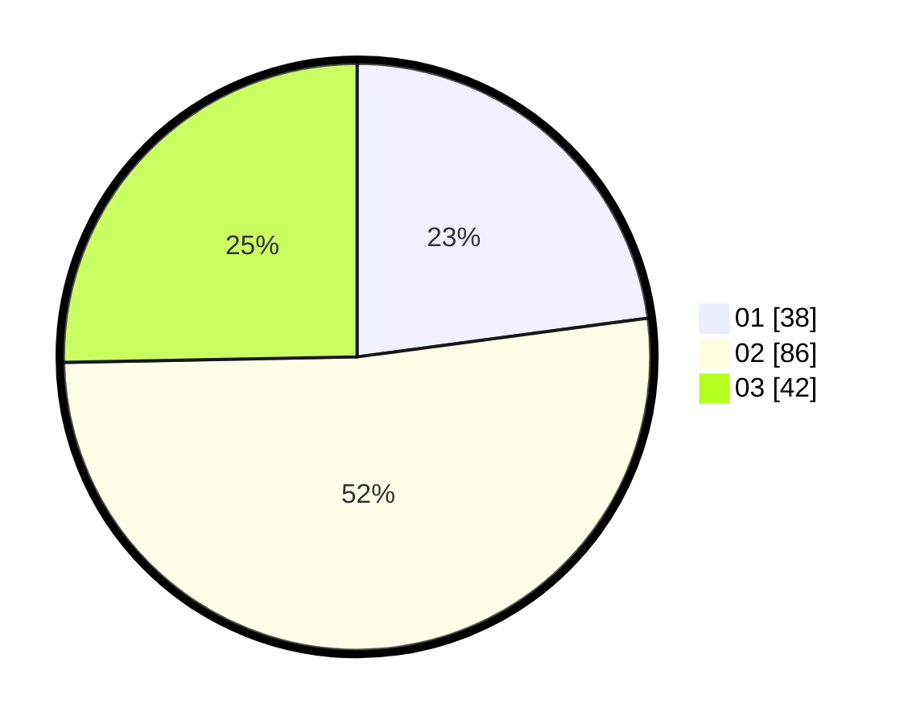

# Hasil

Hasil perolehan suara paslon dapat dilihat pada file paslon-01.txt, paslon-02.txt, dan paslon-03.txt.

Jika tidak ada, artinya data tersebut belum ada pada SIREKAP.

## Perolehan Suara

 * Paslon 01: **38**.
 * Paslon 02: **86**.
 * Paslon 03: **42**.

## Foto C Plano

https://sirekap-obj-formc.kpu.go.id/8e55/pemilu/ppwp/31/73/03/10/01/3173031001050-20240216-055647--89bd2019-941a-4877-87bf-26d04800540a.jpg

https://sirekap-obj-formc.kpu.go.id/8e55/pemilu/ppwp/31/73/03/10/01/3173031001050-20240216-055649--5129a930-19b3-4e69-afd5-ca9cec7746ab.jpg

https://sirekap-obj-formc.kpu.go.id/8e55/pemilu/ppwp/31/73/03/10/01/3173031001050-20240216-055648--8a216f13-4e68-4a01-ae03-cfe40d14130d.jpg

## DATA PEMILIH TETAP

Jumlah pemilih dalam DPT: **236**.
 * L: **120**.
 * P: **116**.

## DATA PENGGUNA HAK PILIH

Jumlah pengguna hak pilih dalam DPT: **164**.
 * L: **82**.
 * P: **82**.

Jumlah pengguna hak pilih dalam DPTb: **1**.
 * L: **0**.
 * P: **1**.

Jumlah pengguna hak pilih dalam DPK: **0**.
 * L: **0**.
 * P: **0**.

Jumlah pengguna hak pilih: **165**.
 * L: **82**.
 * P: **83**.

## JUMLAH SUARA SAH DAN TIDAK SAH

JUMLAH SELURUH SUARA SAH: **166**.

JUMLAH SUARA TIDAK SAH: **2**.

JUMLAH SELURUH SUARA SAH DAN SUARA TIDAK SAH: **168**.
