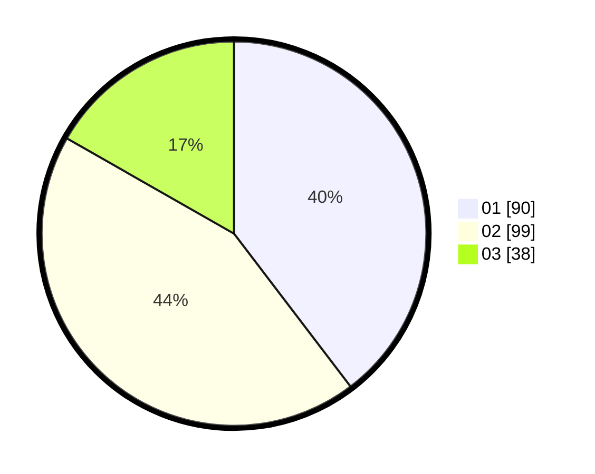

# Hasil

Hasil perolehan suara paslon dapat dilihat pada file paslon-01.txt, paslon-02.txt, dan paslon-03.txt.

Jika tidak ada, artinya data tersebut belum ada pada SIREKAP.

## Perolehan Suara

 * Paslon 01: **90**.
 * Paslon 02: **99**.
 * Paslon 03: **38**.

## Foto C Plano

https://sirekap-obj-formc.kpu.go.id/667c/pemilu/ppwp/31/73/03/10/02/3173031002002-20240215-020909--3ada533c-6930-4b42-a35b-69974db4f699.jpg

https://sirekap-obj-formc.kpu.go.id/667c/pemilu/ppwp/31/73/03/10/02/3173031002002-20240215-013633--19d49cf8-868d-485e-a39d-1c9c8a753fdf.jpg

https://sirekap-obj-formc.kpu.go.id/667c/pemilu/ppwp/31/73/03/10/02/3173031002002-20240215-013807--92498092-439d-4a24-b53d-997fb523261f.jpg
