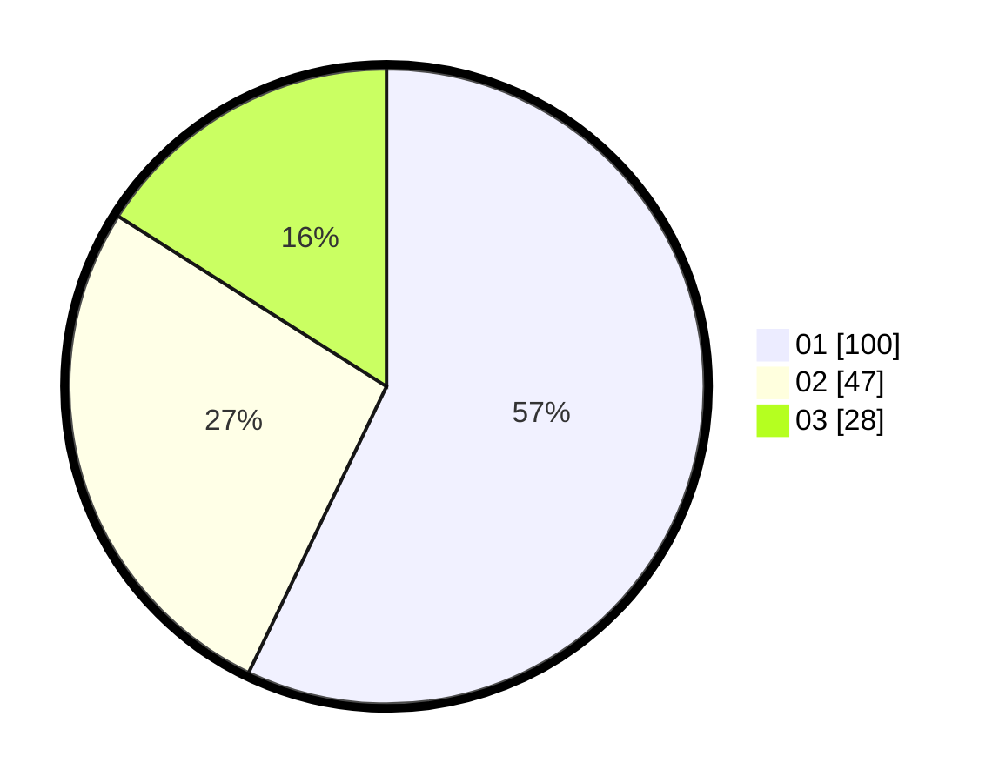

# Hasil

Hasil perolehan suara paslon dapat dilihat pada file paslon-01.txt, paslon-02.txt, dan paslon-03.txt.

Jika tidak ada, artinya data tersebut belum ada pada SIREKAP.

## Perolehan Suara

 * Paslon 01: **100**.
 * Paslon 02: **47**.
 * Paslon 03: **28**.

## Foto C Plano

https://sirekap-obj-formc.kpu.go.id/1a20/pemilu/ppwp/31/73/03/10/02/3173031002005-20240214-225615--f9075daf-e40c-4c57-b4bc-db6906492941.jpg

https://sirekap-obj-formc.kpu.go.id/1a20/pemilu/ppwp/31/73/03/10/02/3173031002005-20240214-225825--58712853-ed5e-4ae4-a36e-a8d7febd91f7.jpg

https://sirekap-obj-formc.kpu.go.id/1a20/pemilu/ppwp/31/73/03/10/02/3173031002005-20240214-230022--2c23f9cb-7995-4ca5-99e3-78f588b3a941.jpg
