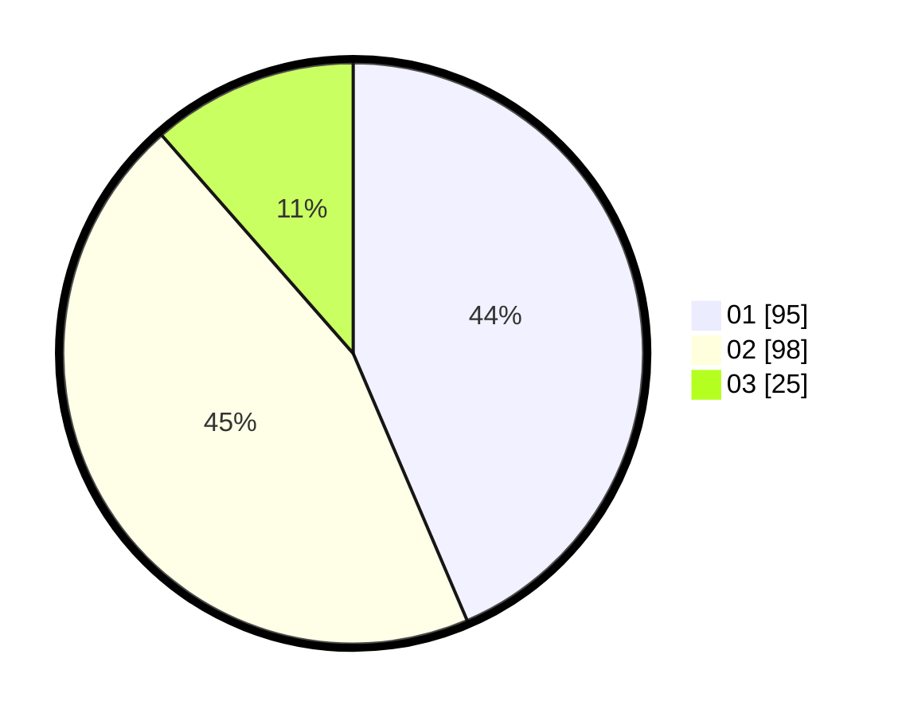

# Hasil

Hasil perolehan suara paslon dapat dilihat pada file paslon-01.txt, paslon-02.txt, dan paslon-03.txt.

Jika tidak ada, artinya data tersebut belum ada pada SIREKAP.

## Perolehan Suara

 * Paslon 01: **95**.
 * Paslon 02: **98**.
 * Paslon 03: **25**.

## Foto C Plano

https://sirekap-obj-formc.kpu.go.id/0f53/pemilu/ppwp/31/73/03/10/02/3173031002015-20240215-020535--11fecb59-0a26-4585-bd9d-49a798635539.jpg

https://sirekap-obj-formc.kpu.go.id/0f53/pemilu/ppwp/31/73/03/10/02/3173031002015-20240215-020557--d8757ec7-18af-4c20-bc69-f267f5b3164c.jpg

https://sirekap-obj-formc.kpu.go.id/0f53/pemilu/ppwp/31/73/03/10/02/3173031002015-20240215-020546--47b182c4-1633-41ae-b910-72ac9ad10864.jpg

## DATA PEMILIH TETAP

Jumlah pemilih dalam DPT: **279**.
 * L: **142**.
 * P: **137**.

## DATA PENGGUNA HAK PILIH

Jumlah pengguna hak pilih dalam DPT: **222**.
 * L: **113**.
 * P: **109**.

Jumlah pengguna hak pilih dalam DPTb: **2**.
 * L: **1**.
 * P: **1**.

Jumlah pengguna hak pilih dalam DPK: **0**.
 * L: **0**.
 * P: **0**.

Jumlah pengguna hak pilih: **224**.
 * L: **114**.
 * P: **110**.

## JUMLAH SUARA SAH DAN TIDAK SAH

JUMLAH SELURUH SUARA SAH: **218**.

JUMLAH SUARA TIDAK SAH: **6**.

JUMLAH SELURUH SUARA SAH DAN SUARA TIDAK SAH: **224**.
