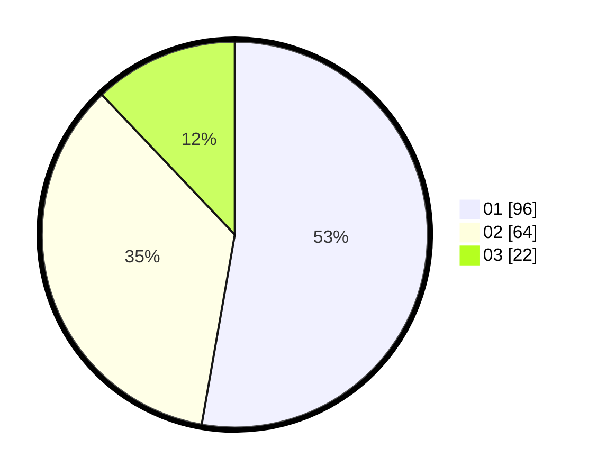

# Hasil

Hasil perolehan suara paslon dapat dilihat pada file paslon-01.txt, paslon-02.txt, dan paslon-03.txt.

Jika tidak ada, artinya data tersebut belum ada pada SIREKAP.

## Perolehan Suara

 * Paslon 01: **96**.
 * Paslon 02: **64**.
 * Paslon 03: **22**.

## Foto C Plano

https://sirekap-obj-formc.kpu.go.id/c5a6/pemilu/ppwp/31/73/03/10/02/3173031002022-20240214-205219--df0ec97a-e461-4833-bc0f-587be6ebb952.jpg

https://sirekap-obj-formc.kpu.go.id/c5a6/pemilu/ppwp/31/73/03/10/02/3173031002022-20240214-204954--5633ffeb-e1d8-45dd-9764-489742182dea.jpg

https://sirekap-obj-formc.kpu.go.id/c5a6/pemilu/ppwp/31/73/03/10/02/3173031002022-20240215-001000--bef62de3-b371-46c8-8586-315e28a82e50.jpg

## DATA PEMILIH TETAP

Jumlah pemilih dalam DPT: **225**.
 * L: **112**.
 * P: **113**.

## DATA PENGGUNA HAK PILIH

Jumlah pengguna hak pilih dalam DPT: **179**.
 * L: **92**.
 * P: **87**.

Jumlah pengguna hak pilih dalam DPTb: **2**.
 * L: **2**.
 * P: **0**.

Jumlah pengguna hak pilih dalam DPK: **3**.
 * L: **2**.
 * P: **1**.

Jumlah pengguna hak pilih: **184**.
 * L: **96**.
 * P: **88**.

## JUMLAH SUARA SAH DAN TIDAK SAH

JUMLAH SELURUH SUARA SAH: **1**.

JUMLAH SUARA TIDAK SAH: **1**.

JUMLAH SELURUH SUARA SAH DAN SUARA TIDAK SAH: **2**.
