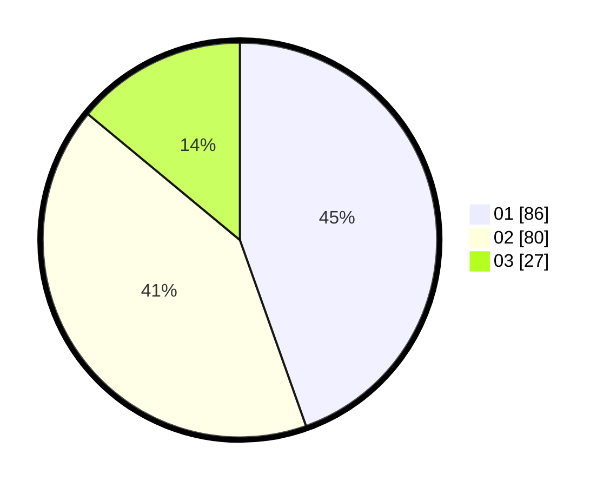

# Hasil

Hasil perolehan suara paslon dapat dilihat pada file paslon-01.txt, paslon-02.txt, dan paslon-03.txt.

Jika tidak ada, artinya data tersebut belum ada pada SIREKAP.

## Perolehan Suara

 * Paslon 01: **86**.
 * Paslon 02: **80**.
 * Paslon 03: **27**.

## Foto C Plano

https://sirekap-obj-formc.kpu.go.id/3fac/pemilu/ppwp/31/73/03/10/02/3173031002023-20240215-213758--54810428-d650-41a1-b76b-6036e889472f.jpg

https://sirekap-obj-formc.kpu.go.id/3fac/pemilu/ppwp/31/73/03/10/02/3173031002023-20240215-213801--e45dc780-bfc2-417d-9163-ad00a657e212.jpg

https://sirekap-obj-formc.kpu.go.id/3fac/pemilu/ppwp/31/73/03/10/02/3173031002023-20240215-213800--50559abb-3445-48b2-9b3f-d9312e4874e2.jpg

## DATA PEMILIH TETAP

Jumlah pemilih dalam DPT: **222**.
 * L: **122**.
 * P: **100**.

## DATA PENGGUNA HAK PILIH

Jumlah pengguna hak pilih dalam DPT: **189**.
 * L: **102**.
 * P: **87**.

Jumlah pengguna hak pilih dalam DPTb: **2**.
 * L: **2**.
 * P: **0**.

Jumlah pengguna hak pilih dalam DPK: **4**.
 * L: **1**.
 * P: **3**.

Jumlah pengguna hak pilih: **195**.
 * L: **105**.
 * P: **90**.

## JUMLAH SUARA SAH DAN TIDAK SAH

JUMLAH SELURUH SUARA SAH: **193**.

JUMLAH SUARA TIDAK SAH: **2**.

JUMLAH SELURUH SUARA SAH DAN SUARA TIDAK SAH: **195**.
