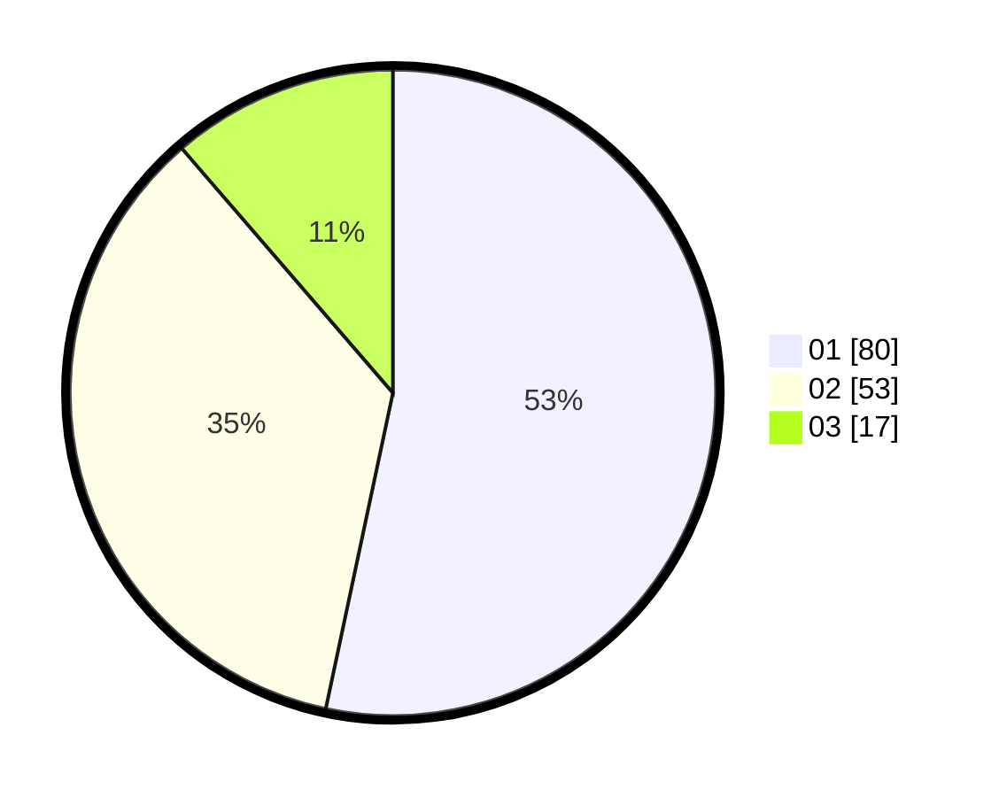

# Hasil

Hasil perolehan suara paslon dapat dilihat pada file paslon-01.txt, paslon-02.txt, dan paslon-03.txt.

Jika tidak ada, artinya data tersebut belum ada pada SIREKAP.

## Perolehan Suara

 * Paslon 01: **80**.
 * Paslon 02: **53**.
 * Paslon 03: **17**.

## Foto C Plano

https://sirekap-obj-formc.kpu.go.id/8265/pemilu/ppwp/31/73/03/10/02/3173031002026-20240215-005725--dce85cc0-1a16-407e-a933-946c6bc7e176.jpg

https://sirekap-obj-formc.kpu.go.id/8265/pemilu/ppwp/31/73/03/10/02/3173031002026-20240215-005846--81b89020-a00c-48ef-9d77-86fdb6915c2b.jpg

https://sirekap-obj-formc.kpu.go.id/8265/pemilu/ppwp/31/73/03/10/02/3173031002026-20240215-005953--002a169b-d7e6-488b-ae0b-cc2a7ca579f2.jpg
