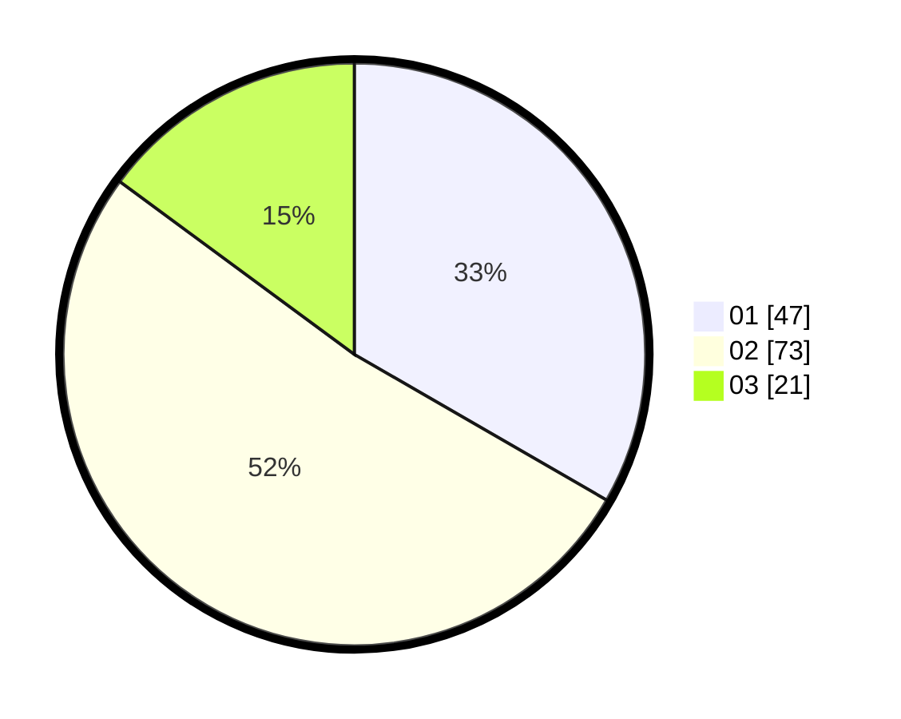

# Hasil

Hasil perolehan suara paslon dapat dilihat pada file paslon-01.txt, paslon-02.txt, dan paslon-03.txt.

Jika tidak ada, artinya data tersebut belum ada pada SIREKAP.

## Perolehan Suara

 * Paslon 01: **47**.
 * Paslon 02: **73**.
 * Paslon 03: **21**.

## Foto C Plano

https://sirekap-obj-formc.kpu.go.id/8c84/pemilu/ppwp/31/73/03/10/02/3173031002027-20240217-171545--59e937c9-9719-4598-b897-c84306336e86.jpg

https://sirekap-obj-formc.kpu.go.id/8c84/pemilu/ppwp/31/73/03/10/02/3173031002027-20240217-171547--a80344f2-1928-486f-be14-0a357650bcbe.jpg

https://sirekap-obj-formc.kpu.go.id/8c84/pemilu/ppwp/31/73/03/10/02/3173031002027-20240217-171546--267b1d92-f5b2-4b52-846c-47c03f6cbc16.jpg

## DATA PEMILIH TETAP

Jumlah pemilih dalam DPT: **200**.
 * L: **99**.
 * P: **101**.

## DATA PENGGUNA HAK PILIH

Jumlah pengguna hak pilih dalam DPT: **140**.
 * L: **66**.
 * P: **74**.

Jumlah pengguna hak pilih dalam DPTb: **1**.
 * L: **1**.
 * P: **0**.

Jumlah pengguna hak pilih dalam DPK: **1**.
 * L: **1**.
 * P: **0**.

Jumlah pengguna hak pilih: **142**.
 * L: **68**.
 * P: **74**.

## JUMLAH SUARA SAH DAN TIDAK SAH

JUMLAH SELURUH SUARA SAH: **0**.

JUMLAH SUARA TIDAK SAH: **0**.

JUMLAH SELURUH SUARA SAH DAN SUARA TIDAK SAH: **0**.
