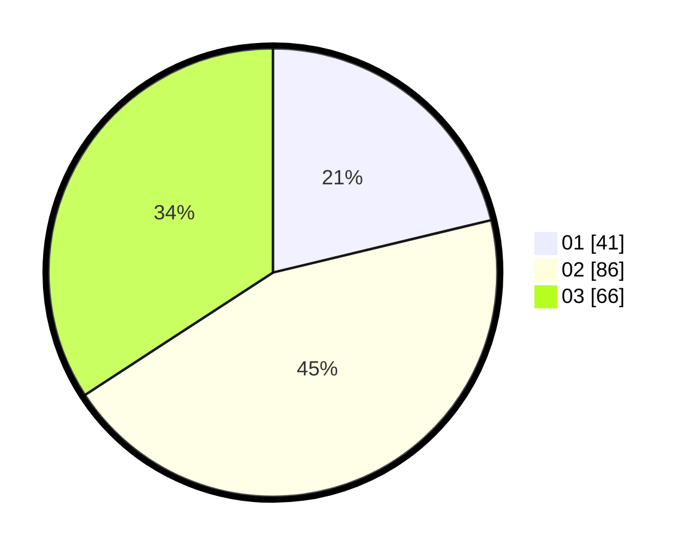

# Hasil

Hasil perolehan suara paslon dapat dilihat pada file paslon-01.txt, paslon-02.txt, dan paslon-03.txt.

Jika tidak ada, artinya data tersebut belum ada pada SIREKAP.

## Perolehan Suara

 * Paslon 01: **41**.
 * Paslon 02: **86**.
 * Paslon 03: **66**.

## Foto C Plano

https://sirekap-obj-formc.kpu.go.id/25a7/pemilu/ppwp/31/73/03/10/02/3173031002028-20240215-003223--ef9f3c38-87d0-4f03-aeeb-30ed1a05f045.jpg

https://sirekap-obj-formc.kpu.go.id/25a7/pemilu/ppwp/31/73/03/10/02/3173031002028-20240215-003244--7a328974-a0f5-485d-9f0d-7015f6c9f565.jpg

https://sirekap-obj-formc.kpu.go.id/25a7/pemilu/ppwp/31/73/03/10/02/3173031002028-20240215-003300--bcbfb50d-542f-4d09-a13b-aabd7bdad1b7.jpg
