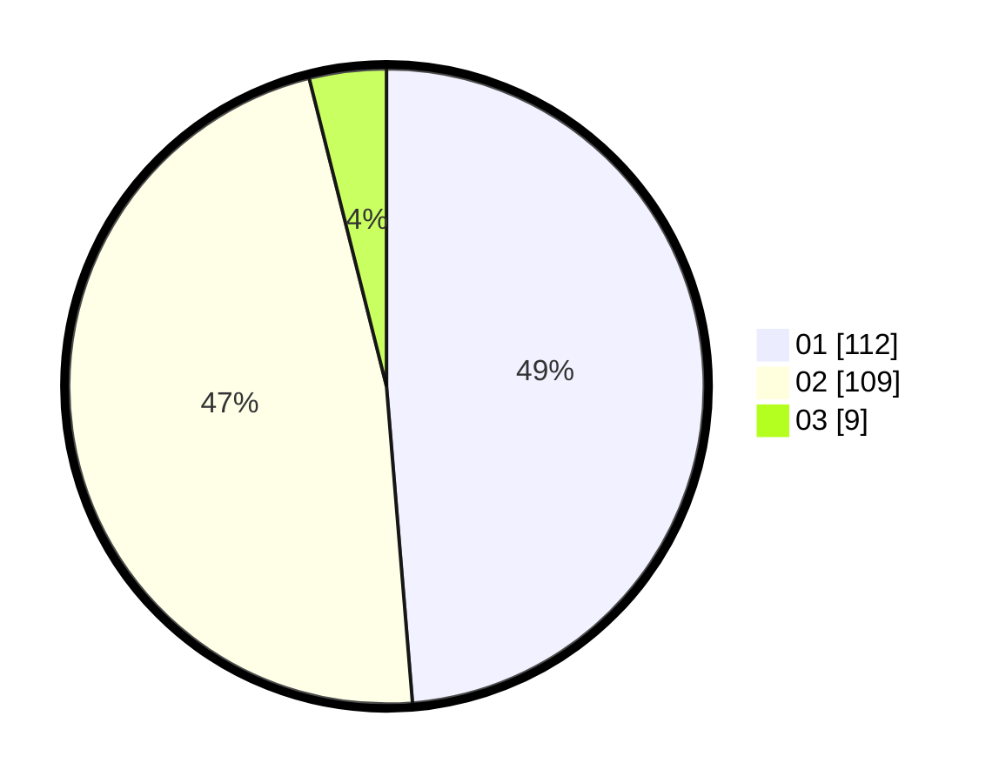

# Hasil

Hasil perolehan suara paslon dapat dilihat pada file paslon-01.txt, paslon-02.txt, dan paslon-03.txt.

Jika tidak ada, artinya data tersebut belum ada pada SIREKAP.

## Perolehan Suara

 * Paslon 01: **112**.
 * Paslon 02: **109**.
 * Paslon 03: **9**.

## Foto C Plano

https://sirekap-obj-formc.kpu.go.id/42c0/pemilu/ppwp/31/73/03/10/02/3173031002032-20240215-021816--7dcf71c0-460f-4df6-9f7c-6994d70ea90b.jpg

https://sirekap-obj-formc.kpu.go.id/42c0/pemilu/ppwp/31/73/03/10/02/3173031002032-20240215-022009--61dc6dfc-5848-49d3-86b2-54bf93e70241.jpg

https://sirekap-obj-formc.kpu.go.id/42c0/pemilu/ppwp/31/73/03/10/02/3173031002032-20240215-022101--6138d846-ff08-43ce-bc05-088b0406138f.jpg
