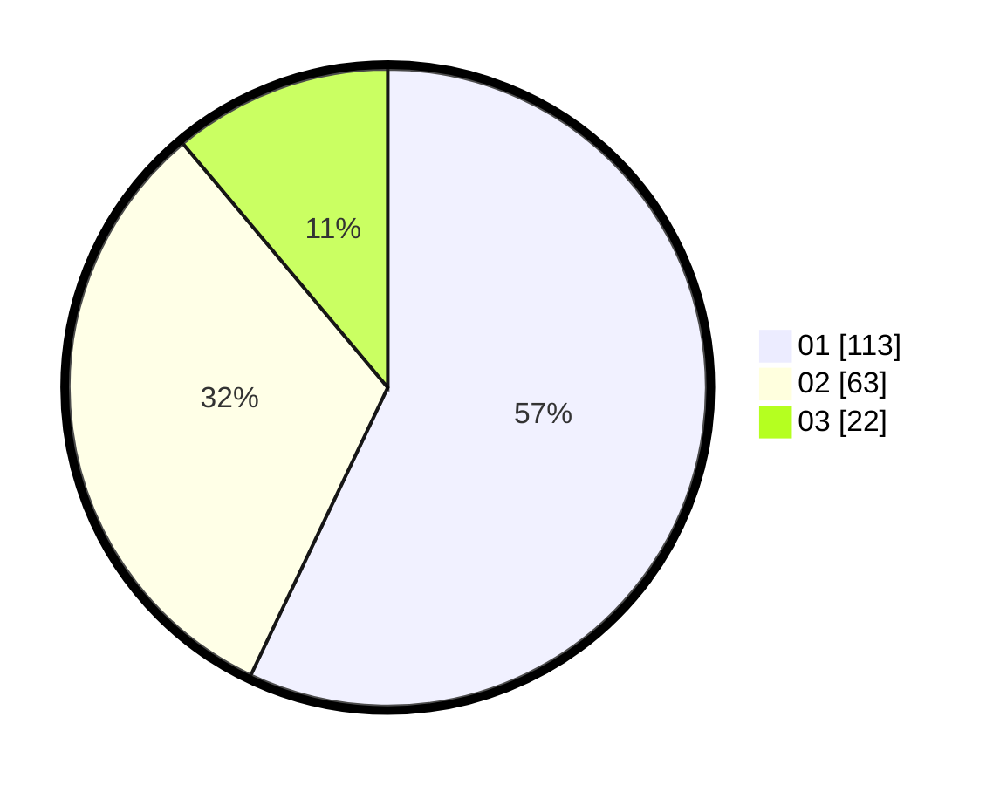

# Hasil

Hasil perolehan suara paslon dapat dilihat pada file paslon-01.txt, paslon-02.txt, dan paslon-03.txt.

Jika tidak ada, artinya data tersebut belum ada pada SIREKAP.

## Perolehan Suara

 * Paslon 01: **113**.
 * Paslon 02: **63**.
 * Paslon 03: **22**.

## Foto C Plano

https://sirekap-obj-formc.kpu.go.id/5b53/pemilu/ppwp/31/73/03/10/02/3173031002036-20240214-155200--e8026667-d909-428c-8b8d-84e6dd71ff52.jpg

https://sirekap-obj-formc.kpu.go.id/5b53/pemilu/ppwp/31/73/03/10/02/3173031002036-20240214-155842--ab69ae17-38f3-473e-bedf-3d4f7ef0184d.jpg

https://sirekap-obj-formc.kpu.go.id/5b53/pemilu/ppwp/31/73/03/10/02/3173031002036-20240214-162230--38c85f45-436b-40cb-9cde-da9a204589de.jpg

## DATA PEMILIH TETAP

Jumlah pemilih dalam DPT: **251**.
 * L: **131**.
 * P: **120**.

## DATA PENGGUNA HAK PILIH

Jumlah pengguna hak pilih dalam DPT: **196**.
 * L: **99**.
 * P: **97**.

Jumlah pengguna hak pilih dalam DPTb: **3**.
 * L: **1**.
 * P: **2**.

Jumlah pengguna hak pilih dalam DPK: **0**.
 * L: **0**.
 * P: **0**.

Jumlah pengguna hak pilih: **199**.
 * L: **100**.
 * P: **99**.

## JUMLAH SUARA SAH DAN TIDAK SAH

JUMLAH SELURUH SUARA SAH: **198**.

JUMLAH SUARA TIDAK SAH: **1**.

JUMLAH SELURUH SUARA SAH DAN SUARA TIDAK SAH: **199**.
