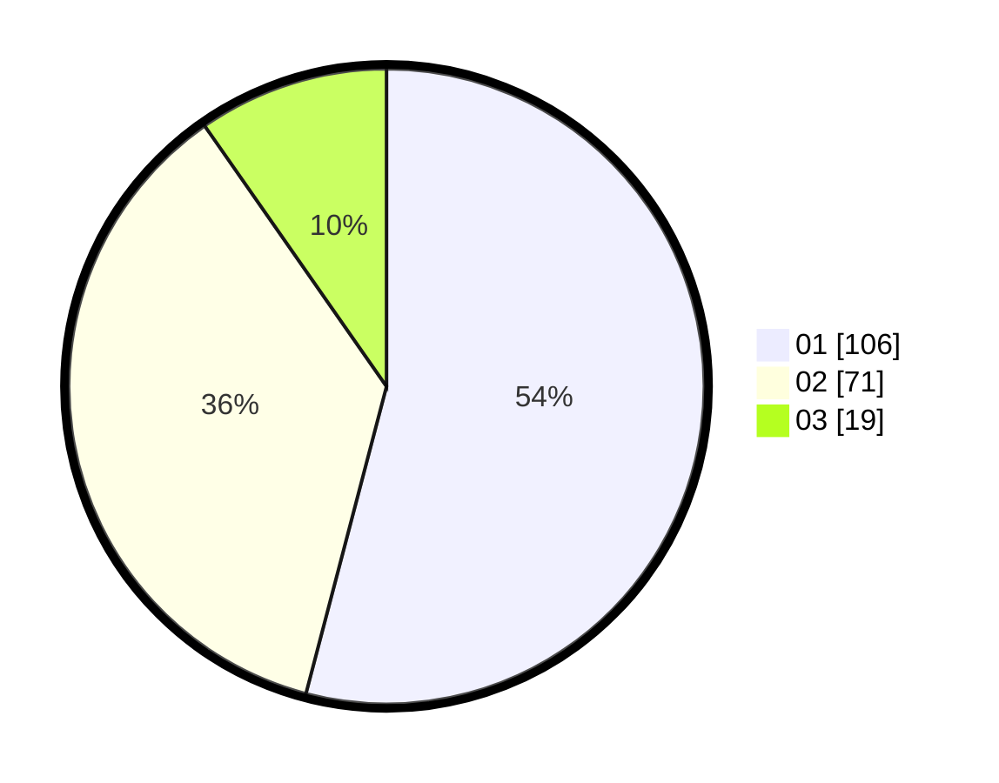

# Hasil

Hasil perolehan suara paslon dapat dilihat pada file paslon-01.txt, paslon-02.txt, dan paslon-03.txt.

Jika tidak ada, artinya data tersebut belum ada pada SIREKAP.

## Perolehan Suara

 * Paslon 01: **106**.
 * Paslon 02: **71**.
 * Paslon 03: **19**.

## Foto C Plano

https://sirekap-obj-formc.kpu.go.id/d243/pemilu/ppwp/31/73/03/10/02/3173031002037-20240214-202432--d111486f-8938-420b-834c-b7f9f4c9f518.jpg

https://sirekap-obj-formc.kpu.go.id/d243/pemilu/ppwp/31/73/03/10/02/3173031002037-20240214-221452--4d4bab5c-3257-47dd-977f-4d8fdc97e889.jpg

https://sirekap-obj-formc.kpu.go.id/d243/pemilu/ppwp/31/73/03/10/02/3173031002037-20240214-221412--784e4bcd-72b0-4477-8bf9-c7e691dc1a79.jpg

## DATA PEMILIH TETAP

Jumlah pemilih dalam DPT: **267**.
 * L: **143**.
 * P: **124**.

## DATA PENGGUNA HAK PILIH

Jumlah pengguna hak pilih dalam DPT: **193**.
 * L: **101**.
 * P: **92**.

Jumlah pengguna hak pilih dalam DPTb: **3**.
 * L: **3**.
 * P: **0**.

Jumlah pengguna hak pilih dalam DPK: **6**.
 * L: **4**.
 * P: **2**.

Jumlah pengguna hak pilih: **202**.
 * L: **108**.
 * P: **94**.

## JUMLAH SUARA SAH DAN TIDAK SAH

JUMLAH SELURUH SUARA SAH: **196**.

JUMLAH SUARA TIDAK SAH: **6**.

JUMLAH SELURUH SUARA SAH DAN SUARA TIDAK SAH: **202**.
