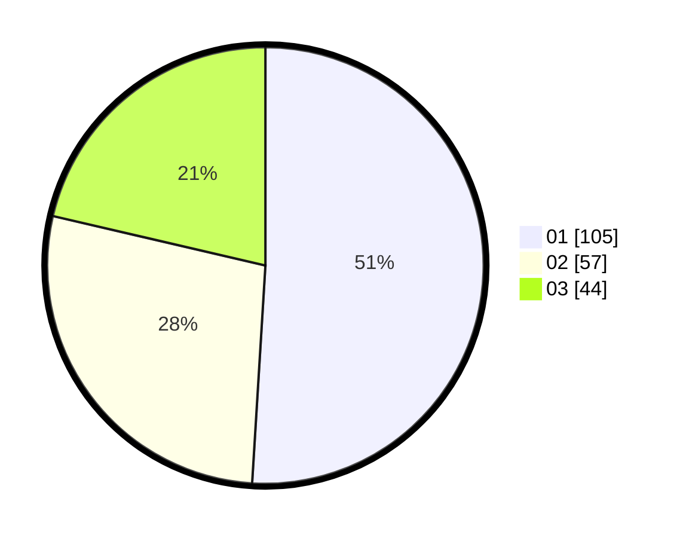

# Hasil

Hasil perolehan suara paslon dapat dilihat pada file paslon-01.txt, paslon-02.txt, dan paslon-03.txt.

Jika tidak ada, artinya data tersebut belum ada pada SIREKAP.

## Perolehan Suara

 * Paslon 01: **105**.
 * Paslon 02: **57**.
 * Paslon 03: **44**.

## Foto C Plano

https://sirekap-obj-formc.kpu.go.id/40c0/pemilu/ppwp/31/73/03/10/02/3173031002040-20240214-190938--060f929d-d7b2-469f-8712-997400fb80ea.jpg

https://sirekap-obj-formc.kpu.go.id/40c0/pemilu/ppwp/31/73/03/10/02/3173031002040-20240214-191700--7e05ddea-d664-4662-bc69-9352b55cc501.jpg

https://sirekap-obj-formc.kpu.go.id/40c0/pemilu/ppwp/31/73/03/10/02/3173031002040-20240215-005453--201ba066-0eb0-41ac-bd72-b5eebcc37ae3.jpg
