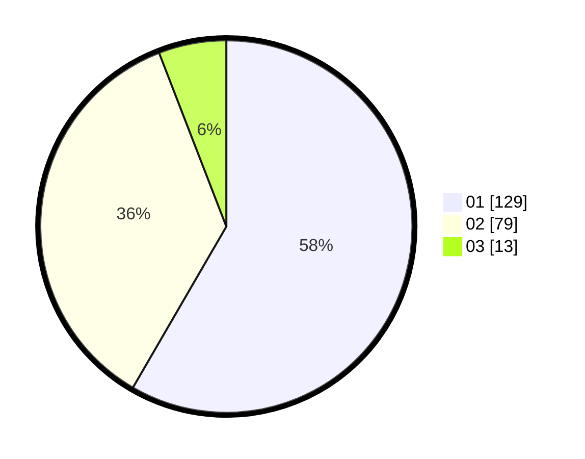

# Hasil

Hasil perolehan suara paslon dapat dilihat pada file paslon-01.txt, paslon-02.txt, dan paslon-03.txt.

Jika tidak ada, artinya data tersebut belum ada pada SIREKAP.

## Perolehan Suara

 * Paslon 01: **129**.
 * Paslon 02: **79**.
 * Paslon 03: **13**.

## Foto C Plano

https://sirekap-obj-formc.kpu.go.id/c3a0/pemilu/ppwp/31/73/03/10/02/3173031002042-20240214-195008--e1c3069f-46a9-4155-a7aa-d7de2d1503b8.jpg

https://sirekap-obj-formc.kpu.go.id/c3a0/pemilu/ppwp/31/73/03/10/02/3173031002042-20240214-193451--b44d5571-a279-4246-8ff0-6eed0145c8e1.jpg

https://sirekap-obj-formc.kpu.go.id/c3a0/pemilu/ppwp/31/73/03/10/02/3173031002042-20240214-193555--590082d0-b57c-461e-b5d7-758deb515ce3.jpg

## DATA PEMILIH TETAP

Jumlah pemilih dalam DPT: **272**.
 * L: **132**.
 * P: **140**.

## DATA PENGGUNA HAK PILIH

Jumlah pengguna hak pilih dalam DPT: **218**.
 * L: **101**.
 * P: **117**.

Jumlah pengguna hak pilih dalam DPTb: **4**.
 * L: **3**.
 * P: **1**.

Jumlah pengguna hak pilih dalam DPK: **1**.
 * L: **1**.
 * P: **0**.

Jumlah pengguna hak pilih: **223**.
 * L: **105**.
 * P: **118**.

## JUMLAH SUARA SAH DAN TIDAK SAH

JUMLAH SELURUH SUARA SAH: **221**.

JUMLAH SUARA TIDAK SAH: **2**.

JUMLAH SELURUH SUARA SAH DAN SUARA TIDAK SAH: **223**.
