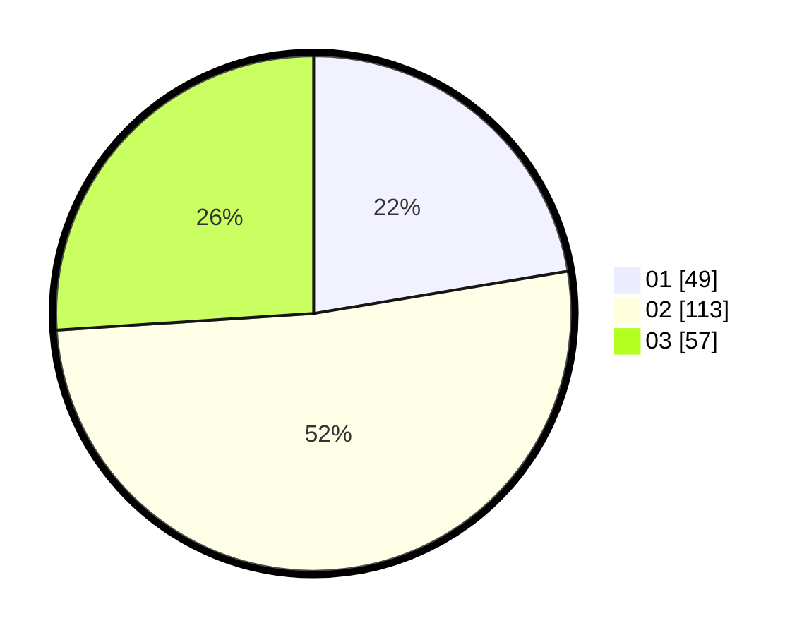

# Hasil

Hasil perolehan suara paslon dapat dilihat pada file paslon-01.txt, paslon-02.txt, dan paslon-03.txt.

Jika tidak ada, artinya data tersebut belum ada pada SIREKAP.

## Perolehan Suara

 * Paslon 01: **49**.
 * Paslon 02: **113**.
 * Paslon 03: **57**.

## Foto C Plano

https://sirekap-obj-formc.kpu.go.id/663e/pemilu/ppwp/31/73/03/10/02/3173031002044-20240214-234229--8bd1bf0d-6e72-49d0-93ea-f3049f982631.jpg

https://sirekap-obj-formc.kpu.go.id/663e/pemilu/ppwp/31/73/03/10/02/3173031002044-20240214-200139--f234874b-a7a1-48ee-ada3-a3964094c188.jpg

https://sirekap-obj-formc.kpu.go.id/663e/pemilu/ppwp/31/73/03/10/02/3173031002044-20240214-234331--5480f355-a660-4c16-ba53-4936a9bf97b1.jpg
