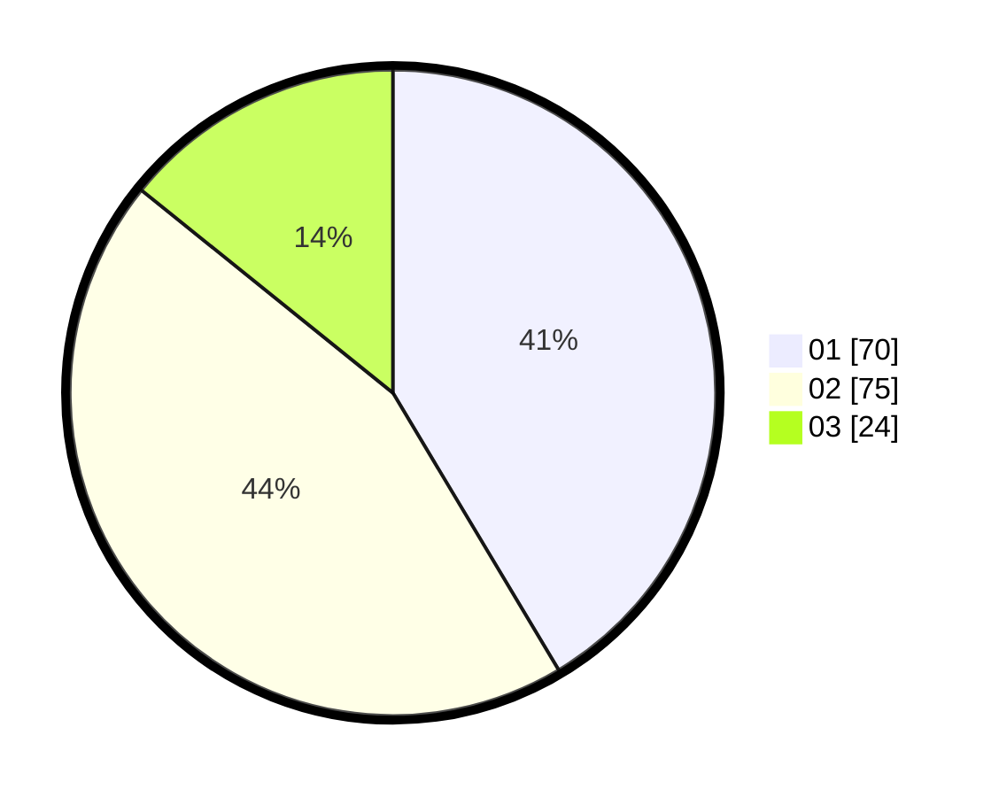

# Hasil

Hasil perolehan suara paslon dapat dilihat pada file paslon-01.txt, paslon-02.txt, dan paslon-03.txt.

Jika tidak ada, artinya data tersebut belum ada pada SIREKAP.

## Perolehan Suara

 * Paslon 01: **70**.
 * Paslon 02: **75**.
 * Paslon 03: **24**.

## Foto C Plano

https://sirekap-obj-formc.kpu.go.id/0483/pemilu/ppwp/31/73/03/10/02/3173031002046-20240214-203906--6190748e-f57a-4106-bf64-5984ea452f75.jpg

https://sirekap-obj-formc.kpu.go.id/0483/pemilu/ppwp/31/73/03/10/02/3173031002046-20240214-155616--8e292dfa-bd3c-43b7-a83b-b847cb4ebfb7.jpg

https://sirekap-obj-formc.kpu.go.id/0483/pemilu/ppwp/31/73/03/10/02/3173031002046-20240214-203859--eeb6bd18-3fcd-4b88-813e-f7aee22557d0.jpg
