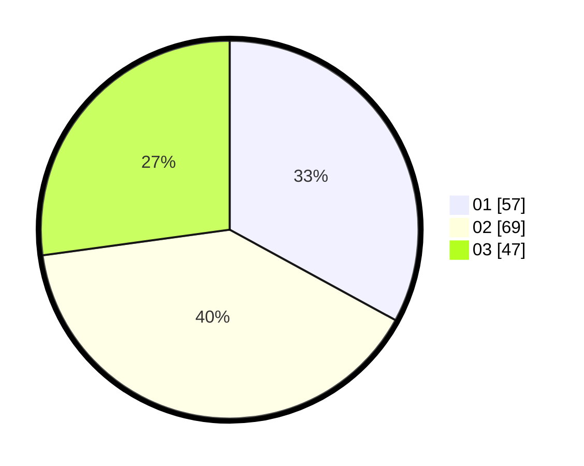

# Hasil

Hasil perolehan suara paslon dapat dilihat pada file paslon-01.txt, paslon-02.txt, dan paslon-03.txt.

Jika tidak ada, artinya data tersebut belum ada pada SIREKAP.

## Perolehan Suara

 * Paslon 01: **57**.
 * Paslon 02: **69**.
 * Paslon 03: **47**.

## Foto C Plano

https://sirekap-obj-formc.kpu.go.id/db8a/pemilu/ppwp/31/73/03/10/02/3173031002049-20240214-155916--61f01bcc-4cd0-4018-a14d-67d10e121dee.jpg

https://sirekap-obj-formc.kpu.go.id/db8a/pemilu/ppwp/31/73/03/10/02/3173031002049-20240214-160105--a3dec144-3508-4c72-b509-7559e84176a1.jpg

https://sirekap-obj-formc.kpu.go.id/db8a/pemilu/ppwp/31/73/03/10/02/3173031002049-20240214-160126--1189882f-64bf-4b9a-916e-3b3dc9678c88.jpg
