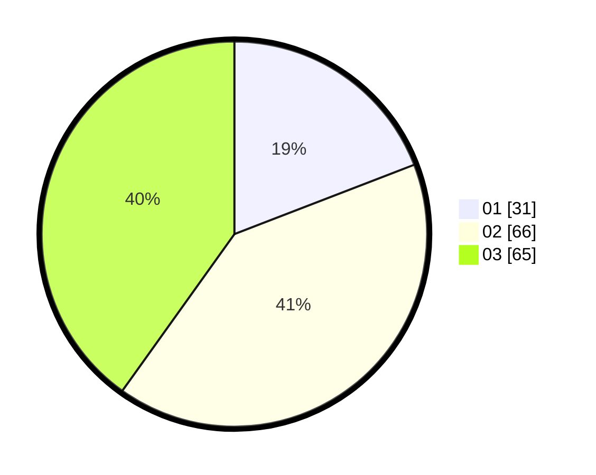

# Hasil

Hasil perolehan suara paslon dapat dilihat pada file paslon-01.txt, paslon-02.txt, dan paslon-03.txt.

Jika tidak ada, artinya data tersebut belum ada pada SIREKAP.

## Perolehan Suara

 * Paslon 01: **31**.
 * Paslon 02: **66**.
 * Paslon 03: **65**.

## Foto C Plano

https://sirekap-obj-formc.kpu.go.id/cf3f/pemilu/ppwp/31/73/03/10/02/3173031002051-20240215-210010--1d03af69-d200-4b97-a183-87531310cd7d.jpg

https://sirekap-obj-formc.kpu.go.id/cf3f/pemilu/ppwp/31/73/03/10/02/3173031002051-20240215-210012--dcc0a1e7-d236-4744-8fac-3b120aeb7e71.jpg

https://sirekap-obj-formc.kpu.go.id/cf3f/pemilu/ppwp/31/73/03/10/02/3173031002051-20240215-210011--bfd4ec89-5d4e-4e7b-8ccb-e05c9626077c.jpg

## DATA PEMILIH TETAP

Jumlah pemilih dalam DPT: **263**.
 * L: **120**.
 * P: **143**.

## DATA PENGGUNA HAK PILIH

Jumlah pengguna hak pilih dalam DPT: **157**.
 * L: **72**.
 * P: **85**.

Jumlah pengguna hak pilih dalam DPTb: **2**.
 * L: **2**.
 * P: **0**.

Jumlah pengguna hak pilih dalam DPK: **5**.
 * L: **1**.
 * P: **4**.

Jumlah pengguna hak pilih: **164**.
 * L: **75**.
 * P: **89**.

## JUMLAH SUARA SAH DAN TIDAK SAH

JUMLAH SELURUH SUARA SAH: **162**.

JUMLAH SUARA TIDAK SAH: **2**.

JUMLAH SELURUH SUARA SAH DAN SUARA TIDAK SAH: **164**.
